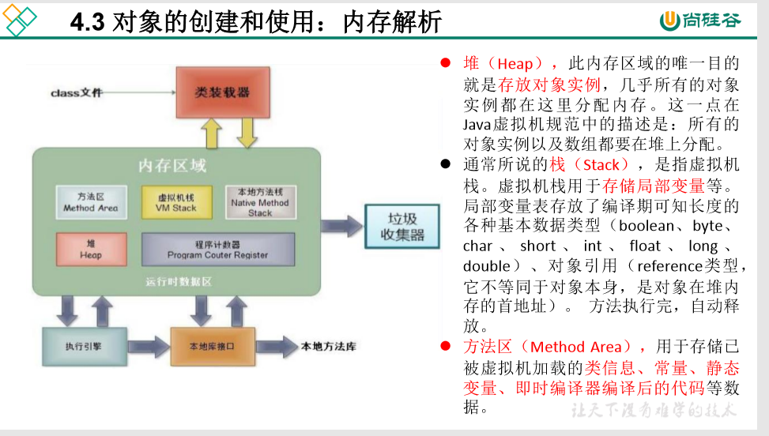
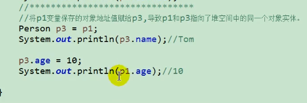
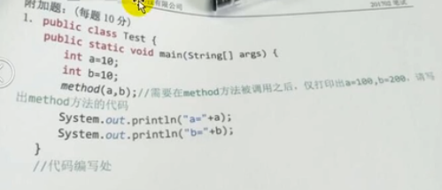
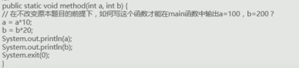
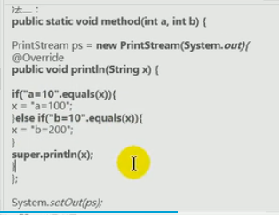
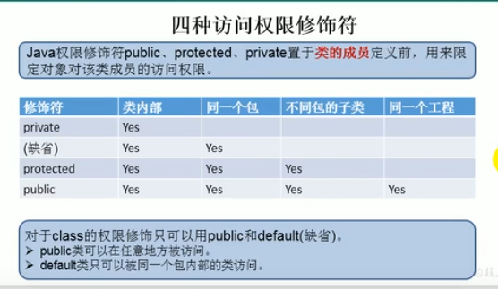
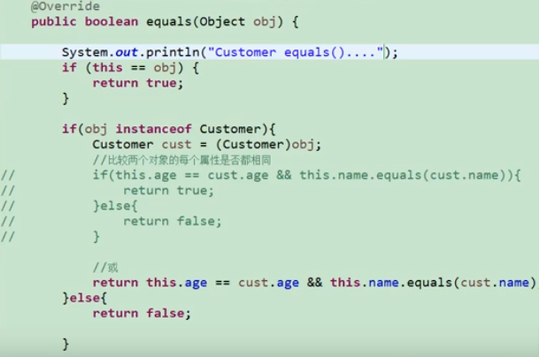

## 第一章

#### 面向对象的三大特征

封装、多态、继承

#### 面向过程

强调的是功能行为、以函数为单位，考虑怎么做

#### 面向对象

强调具备了功能的对象，以类/对象为的单位，考虑谁来做

#### 内存解析



**所有的对象实例以及数组都要在堆上分配**

#### 对象是引用传递

对于对象，java是引用传递，如果 user1的id为1，新建一个user2 =user1，然后使  user2.id =2；

那么 此时user1 的id 也是2 .



#### 成员变量、局部变量

相同：

先声明、后使用

不同：

- 局部变量：申明在方法内、方法形参、代码块内、构造器形参、构造器内部的变量

- 成员：直接定义在类的内部

  类的属性，会根据器类型，都有默认初始化值。

#### Java的实参值如何传入方法？

java 里的方法的参数传递方式只有一种：  **值传递**。即将实际参数值的副本（复制品）传入方法内，而参数不受影响/

- 形参是基本数据类型：将实参基本数据类变量的“数据值” 传递给形参。

- 形参是引用数据类型：将实参引用数据类型变量的“地址值” 传递给形参。


#### 题1



  抖机灵1：



  

  

### Java 规定的4种权限修饰符

private 、default、protected 、public 



### equals（）方法的使用

只能用于引用数据类型

比较两个对象的地址值是否相同，即两个引用是否指向同一块内存

像String、Date、包装类等都重写了equals（）方法。重写以后，比较的不是两个引用的地址是否相同，而是比较两个对象的“实体内容”是否相同。

### 重写equals（）方法

String 的底层其实是一个字符数组 char[] 

```java
public final class String
    implements java.io.Serializable, Comparable<String>, CharSequence {
    /** The value is used for character storage. */
    private final char value[];
```


对于对象，要比较每个属性的属性值是否相同




## Static 关键字

某些特定的数据在内存空间里只有一份

1. static：静态的

2. 修饰属性、方法、代码块、内部类

3. 使用static修饰属性    静态变量

   属性： 按是否使用static 修饰，又分为 ： 静态属性  非静态属性（实例变量）

   **实例变量**：我们创建了类的多个对象，每个对象都有独立的拥有一套类中的非静态属性。

   ​				当修改非静态属性时，不会导致其他对象中同样的属性值的修改。

   **静态变量**：我们创建了类的多个对象，多个对象共享同一个静态变量，当其中一个对象修改过之后，其他的对象调用, 就是修改过的。

   **static修饰属性的其他说明：**

   1. 静态变量随着类的加载而加载。可以通过  类. 静态变量的方式进行调用

   2. 静态变量的加载要早于对象的创建

   3. 由于类只会加载一次，则静态变量在内存中也只会存一份，存放到方法区的静态域中。

   4. ​     类变量      实例变量

      类     yes          no       

   ​      对象      yes     yes
   
   **静态属性举例：** System.out   Math.PI
   
4. 使用static修饰方法：静态方法

   随着类的加载而加载，可以通过 “ 类. 静态方法”的方式进行调用

   ​        静态方法     非静态方法

   类     yes             no       

   对象      yes          yes

   静态方法中  ： 只能调用静态的方法或属性

   非静态方法中   既可以调非静态   又可以调 静态的方法或属性 
   
5. Static 注意
   
   静态的方法内，this   、super 不可以用
   
   
   
6. 开发中，如何确定一个方法、属性是否要声明为static的？

   属性：

   属性是可以对多个对象所共享的，不会随着对象的不同而不同的。

   方法：

   工具类中的方法，习惯上声明为static 的，可以直接调用。

   操作静态属性的方法，通常设置为static的

   