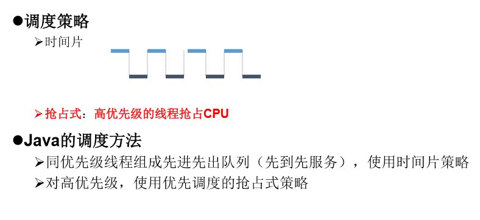
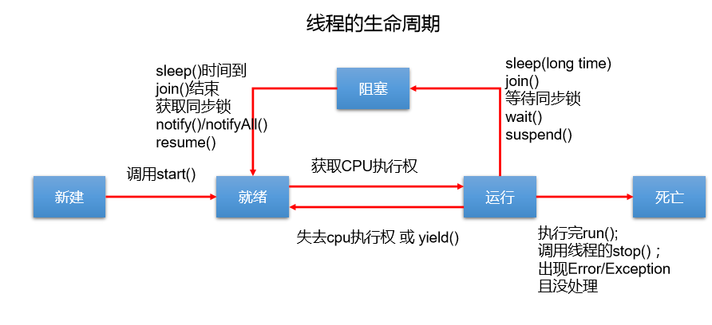
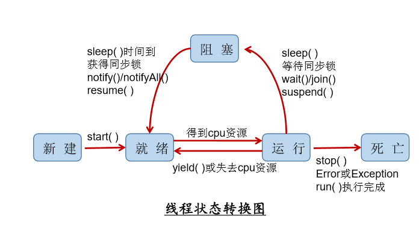

## 第三章 线程

### 程序、进程、线程

`程序`：是为完成特定任务、用某种语言编写的一组指令的集合。即指一段静态的代码。

`进程`：是程序的一次执行过程，或是正在运行的一个程序。是一个动态 的过程：有它自身的产生、存在和消亡的过程。——生命周期 

进程作为资源分配的单位，系统在运行时会为每个进程分配不同的内存区域

`线程`：进程可进一步细化为线程，是一个程序内部的一条执行路径。

 若一个进程同一时间并行执行多个线程，就是支持多线程的 

线程作为调度和执行的单位，每个线程拥有独立的运行栈和程序计数器(pc)，线程切换的开 销小

 一个进程中的多个线程共享相同的内存单元/内存地址空间

它们从同一堆中分配对象，可以 访问相同的变量和对象。这就使得线程间通信更简便、高效。但多个线程操作共享的系统资 源可能就会带来安全的隐患。


多个线程共享方法区、堆。自己拥有自己的虚拟机栈、程序计数器。


### 单核多核

####  单核CPU

其实是一种假的多线程，因为在一个时间单元内，也只能执行一个线程 的任务。例如：虽然有多车道，但是收费站只有一个工作人员在收费，只有收了费 才能通过，那么CPU就好比收费人员。如果有某个人不想交钱，那么收费人员可以 把他“挂起”（晾着他，等他想通了，准备好了钱，再去收费）。但是因为CPU时 间单元特别短，因此感觉不出来。

 如果是多核的话，才能更好的发挥多线程的效率。（现在的服务器都是多核的）

  一个Java应用程序java.exe，其实至少有三个线程：main()主线程，gc() 垃圾回收线程，异常处理线程。当然如果发生异常，会影响主线程。

####   并行与并发 

 并行：多个CPU同时执行多个任务。比如：多个人同时做不同的事。

  并发：一个CPU(采用时间片)同时执行多个任务。比如：秒杀、多个人做同一件事。


### 多线程的优点

背景：以单核CPU为例，只使用单个线程先后完成多个任务（调用多个方 法），肯定比用多个线程来完成用的时间更短，为何仍需多线程呢？

多线程程序的优点： 

1. 提高应用程序的响应。对图形化界面更有意义，可增强用户体验。 
2.  提高计算机系统CPU的利用率 
3.  改善程序结构。将既长又复杂的进程分为多个线程，独立运行，利于理解和 修改

#### 何时需要多线程

 程序需要同时执行两个或多个任务。

 程序需要实现一些需要等待的任务时，如用户输入、文件读写操作、网络操作、搜索等。

 需要一些后台运行的程序时。


### 线程的创建和使用

Java语言的JVM允许程序运行多个线程，它通过`java.lang.Thread `类来体现。

Thread类的特性 

每个线程都是通过某个特定Thread对象的run()方法来完成操作的，经常 把run()方法的主体称为线程体

通过该Thread对象的`start()`方法来启动这个线程，而非直接调用`run()`


####  测试Thread中的常用方法：

1. start():启动当前线程；调用当前线程的run()

2. run(): 通常需要重写Thread类中的此方法，将创建的线程要执行的操作声明在此方法中

3. currentThread():静态方法，返回执行当前代码的线程

4. getName():获取当前线程的名字

5. setName():设置当前线程的名字

6. yield():释放当前cpu的执行权

7. join():在线程a中调用线程b的join(),此时线程a就进入阻塞状态，直到线程b完全执行完以后，线程a才

结束阻塞状态。

8. stop():已过时。当执行此方法时，强制结束当前线程。

9. sleep(long millitime):让当前线程“睡眠”指定的millitime毫秒。在指定的millitime毫秒时间内*，当前线程是阻塞状态。

10. isAlive():判断当前线程是否存活

    

### 创建多线程方式一 ：继承Thread类


```java

//1. 创建一个继承于Thread类的子类
class MyThread extends Thread {
    //2. 重写Thread类的run()
    @Override
    public void run() {
        for (int i = 0; i < 100; i++) {
            if(i % 2 == 0){
                System.out.println(Thread.currentThread().getName() + ":" + i);
            }
        }
    }
}


public class ThreadTest {
    public static void main(String[] args) {
        //3. 创建Thread类的子类的对象
        MyThread t1 = new MyThread();

        //4.通过此对象调用start():①启动当前线程 ② 调用当前线程的run()
        t1.start();
        //问题一：我们不能通过直接调用run()的方式启动线程。
//        t1.run();

        //问题二：再启动一个线程，遍历100以内的偶数。不可以还让已经start()的线程去执行。会报IllegalThreadStateException
//        t1.start();
        //我们需要重新创建一个线程的对象
        MyThread t2 = new MyThread();
        t2.start();


        //如下操作仍然是在main线程中执行的。
        for (int i = 0; i < 100; i++) {
            if(i % 2 == 0){
                System.out.println(Thread.currentThread().getName() + ":" + i + "***********main()************");
            }
        }
    }
}
```

start 方法只可以执行一次，不可以还让已经start()的线程去执行。会报IllegalThreadStateException


####  线程的优先级：

1.

MAX_PRIORITY：10

MIN _PRIORITY：1

NORM_PRIORITY：5  -->默认优先级

2.如何获取和设置当前线程的优先级：

getPriority():获取线程的优先级

setPriority(int p):设置线程的优先级


说明：**高优先级的线程要抢占低优先级线程cpu的执行权。但是只是从概率上讲，高优先级的线程高概率的情况*下被执行。并不意味着只有当高优先级的线程执行完以后，低优先级的线程才执行。**


### 线程调度、线程分类



**Java中的线程分为两类：一种是守护线程，一种是用户线程。**

  它们在几乎每个方面都是相同的，唯一的区别是判断JVM何时离开。 

 守护线程是用来服务用户线程的，通过在start()方法前调用 thread.setDaemon(true)可以把一个用户线程变成一个守护线程。 

 Java垃圾回收就是一个典型的守护线程。 

 若JVM中都是守护线程，当前JVM将退出。 

 形象理解：兔死狗烹，鸟尽弓


### 创建多线程方式二 ：实现Runnable 接口

  1.创建一个实现了Runnable接口的类

2. 实现类去实现Runnable中的抽象方法：run()

3. 创建实现类的对象

4. 将此对象作为参数传递到Thread类的构造器中，创建Thread类的对象

5. 通过Thread类的对象调用start()

```java
//1. 创建一个实现了Runnable接口的类
class MThread implements Runnable{

    //2. 实现类去实现Runnable中的抽象方法：run()
    @Override
    public void run() {
        for (int i = 0; i < 100; i++) {
            if(i % 2 == 0){
                System.out.println(Thread.currentThread().getName() + ":" + i);
            }
        }
    }
}


public class ThreadTest1 {
    public static void main(String[] args) {
        //3. 创建实现类的对象
        MThread mThread = new MThread();
        //4. 将此对象作为参数传递到Thread类的构造器中，创建Thread类的对象
        Thread t1 = new Thread(mThread);
        t1.setName("线程1");
        //5. 通过Thread类的对象调用start():① 启动线程 ②调用当前线程的run()-->调用了Runnable类型的target的run()
        t1.start();
        //再启动一个线程，遍历100以内的偶数
        Thread t2 = new Thread(mThread);
        t2.setName("线程2");
        t2.start();
    }

}

```


### 比较创建线程的两种方式。

**开发中：优先选择：实现Runnable接口的方式**

原因：

1. 实现的方式没有类的单继承性的局限性

2. 实现的方式更适合来处理多个线程有共享数据的情况。

联系：public class Thread implements Runnable

相同点：两种方式都需要重写run(),将线程要执行的逻辑声明在run()中。


### 线程的生命周期

JDK中用Thread.State类定义了线程的几种状态 要想实现多线程，必须在主线程中创建新的线程对象。

Java语言使用Thread类 及其子类的对象来表示线程，在它的一个完整的生命周期中通常要经历如下的五 种状态： 

新建： 当一个Thread类或其子类的对象被声明并创建时，新生的线程对象处于新建 状态 

就绪：处于新建状态的线程被start()后，将进入线程队列等待CPU时间片，此时它已 具备了运行的条件，只是没分配到CPU资源

 运行：当就绪的线程被调度并获得CPU资源时,便进入运行状态， run()方法定义了线 程的操作和功能

 阻塞：在某种特殊情况下，被人为挂起或执行输入输出操作时，让出 CPU 并临时中 止自己的执行，进入阻塞状态 

死亡：线程完成了它的全部工作或线程被提前强制性地中止或出现异常导致结束



suspend（）  挂起



##  线程安全问题存在的原因？

1. 由于一个线程在操作共享数据过程中，未执行完毕的情况下，另外的线程参与景来，导致共享数据存在安全问题。
2. 多个线程执行的不确定性引起执行结果的不稳定
3. 多个线程对账本的共享，会造成操作的不完整性，会破坏数据。


### 线程的同步

创建三个窗口卖票，总票数为100张

即三个线程进行操作，共卖出100张票

当一个线程a 再操作票的时候，其他线程不能参与进来，知道线程a操作完 票的时候，其他线程才可以开始操作票，这种情况即使线程a出现了阻塞，也不能被改变。

### 如何解决线程的安全问题？

必须让一个线程操作共享数据完毕以后，其他线程才有机会参与共享数据的操作。

#### 在java中，使用同步机制，来解决线程安全问题

##### 方法一： 同步代码块  `synchronized `

同步代码块： synchronized ( 同步监视器)  **可以用this 代替（慎用） 可以用当前类代替**  

​	{

​		 // 需要被同步的代码； 

​	}

操作共享的数据代码，即为需要被同步的代码

共享数据：多个和线程共同操作的变量。

同步监视器： 锁     任何一个类的对象，都可以充当锁。

**要求： 多个线程必须要共用同一把锁。**

局限： 相当于一个单线程，效率低


在继承Thread类创建多线程的方式中，慎用this充当同步监视器，考虑使用当前类充当同步监视器。


##### 方法二： synchronized 还可以放在方法声明中，表示整个方法为同步方法。

  public synchronized void show (String name)

​	{ 

​		….

​	}

如果操作共享数据的代码完整的声明在一个方法中，可以将此方法声明同步。


关于同步方法的总结：

1. 同步方法仍然涉及到同步监视器，只是不需要我们显式的声明。

2. 非静态的同步方法，同步监视器是：this

静态的同步方法，同步监视器是：当前类本身


​						继承   	   实现接口

代码块		静态公用        可用synchronized(this) //this表示当前对象

声明方法     不可使用       public synchronized void show() {


**继承Thread实现多线程的方式一般不适用同步方法，因为新建一个线程都会有一个类对象，但是synchronized修饰方法，默认的锁都是this，所以他们对应的锁都是他们各自的this，所以不能使用同步方法。**


对于三个窗口卖票的例子，使用继承的方式时，会创建三个对象，此时就不能使用this来当作同步监视器（即不能使用声明方法来保证线程安全）。而实现接口的办法只是创建了一个对象，可以使用this。


```java
class Window3 implements Runnable {

    private int ticket = 100;

    @Override
    public void run() {
        while (true) {

            show();
        }
    }

    private synchronized void show(){//同步监视器：this
        //synchronized (this){

            if (ticket > 0) {

                try {
                    Thread.sleep(100);
                } catch (InterruptedException e) {
                    e.printStackTrace();
                }

                System.out.println(Thread.currentThread().getName() + ":卖票，票号为：" + ticket);

                ticket--;
            }
        //}
    }
}


public class WindowTest3 {
    public static void main(String[] args) {
        Window3 w = new Window3();

        Thread t1 = new Thread(w);
        Thread t2 = new Thread(w);
        Thread t3 = new Thread(w);

        t1.setName("窗口1");
        t2.setName("窗口2");
        t3.setName("窗口3");

        t1.start();
        t2.start();
        t3.start();
    }

}
```


### 使用同步机制将单例模式中的懒汉式改写为线程安全的

​	

```java
class Bank{

    private Bank(){}

    private static Bank instance = null;

    public static Bank getInstance(){
        //方式一：效率稍差
//        synchronized (Bank.class) {
//            if(instance == null){
//
//                instance = new Bank();
//            }
//            return instance;
//        }
        //方式二：效率更高
        if(instance == null){
            synchronized (Bank.class) {
                if(instance == null){
                    instance = new Bank();
                }

            }
        }
        return instance;
    }
```


### 线程的死锁

#### 死锁 

不同的线程分别占用对方需要的同步资源不放弃，都在等待对方放弃 自己需要的同步资源，就形成了线程的死锁

 出现死锁后，不会出现异常，不会出现提示，只是所有的线程都处于 阻塞状态，无法继续

#### 解决方法 

专门的算法、原则 

尽量减少同步资源的定义 

尽量避免嵌套同步


死锁：

不会出现异常、不会出现提示，所有线程都处于阻塞状态，无法继续

```java
public static void main(String[] args) {
    StringBuffer s1 = new StringBuffer();
    StringBuffer s2 = new StringBuffer();

    new Thread(){
        @Override
        public void run() {
            synchronized (s1){
                s1.append("a");
                s2.append("1");

                try {
                    Thread.sleep(100);
                } catch (InterruptedException e) {
                    e.printStackTrace();
                }
  //先拿了  s1  等待s2    下面的是先拿S2  等待s1    所以互相等待

                synchronized (s2){
                    s1.append("b");
                    s2.append("2");

                    System.out.println(s1);
                    System.out.println(s2);
                }
            }
            super.run();
        }
    }.start();

    new Thread(new Runnable() {
        @Override
        public void run() {
            synchronized (s2){
                s1.append("c");
                s2.append("3");

                try {
                    Thread.sleep(100);
                } catch (InterruptedException e) {
                    e.printStackTrace();
                }

                synchronized (s1){
                    s1.append("d");
                    s2.append("4");

                    System.out.println(s1);
                    System.out.println(s2);
                }
            }

        }
    }).start();
}
```


### Lock 锁 

从JDK 5.0开始，Java提供了更强大的线程同步机制——通过显式定义同 步锁对象来实现同步。同步锁使用Lock对象充当。

 java.util.concurrent.locks.Lock接口是控制多个线程对共享资源进行访问的 工具。锁提供了对共享资源的独占访问，每次只能有一个线程对Lock对象 加锁，线程开始访问共享资源之前应先获得Lock对象。

 ReentrantLock 类实现了 Lock ，它拥有与 synchronized 相同的并发性和 内存语义，在实现线程安全的控制中，比较常用的是ReentrantLock，可以 显式加锁、释放锁。


#### 面试题：synchronized 与 Lock的异同？

相同：二者都可以解决线程安全问题

不同：synchronized机制在执行完相应的同步代码以后，自动的释放同步监视器

Lock需要手动的启动同步（lock()），同时结束同步也需要手动的实现（unlock() ）


#### 2.优先使用顺序：

Lock ---》 同步代码块（已经进入了方法体，分配了相应资源）---》 同步方法（在方法体之外）


#### 面试题：如何解决线程安全问题？有几种方式


```java
class Window implements Runnable{

    private int ticket = 100;
    //1.实例化ReentrantLock
    private ReentrantLock lock = new ReentrantLock();

    @Override
    public void run() {
        while(true){
            try{

                //2.调用锁定方法lock()
                lock.lock();

                if(ticket > 0){

                    try {
                        Thread.sleep(100);
                    } catch (InterruptedException e) {
                        e.printStackTrace();
                    }

                    System.out.println(Thread.currentThread().getName() + "：售票，票号为：" + ticket);
                    ticket--;
                }else{
                    break;
                }
            }finally {
                //3.调用解锁方法：unlock()
                lock.unlock();
            }

        }
    }
}

public class LockTest {
    public static void main(String[] args) {
        Window w = new Window();

        Thread t1 = new Thread(w);
        Thread t2 = new Thread(w);
        Thread t3 = new Thread(w);

        t1.setName("窗口1");
        t2.setName("窗口2");
        t3.setName("窗口3");

        t1.start();
        t2.start();
        t3.start();
    }
}
```


### 线程的通信


#### 线程通信的例子：使用两个线程打印 1-100。线程1, 线程2 交替打印


涉及到的三个方法：

wait():一旦执行此方法，当前线程就进入阻塞状态，并释放同步监视器。


notify():一旦执行此方法，就会唤醒被wait的一个线程。如果有多个线程被wait，就唤醒优先级高的那个。

notifyAll():一旦执行此方法，就会唤醒所有被wait的线程。


说明：

1.wait()，notify()，notifyAll()三个方法必须使用在同步代码块或同步方法中。

2.wait()，notify()，notifyAll()三个方法的调用者必须是同步代码块或同步方法中的同步监视器。

否则，会出现IllegalMonitorStateException异常

3.wait()，notify()，notifyAll()三个方法是定义在java.lang.Object类中。

#### 面试题：sleep() 和 wait()的异同？

1.相同点：一旦执行方法，都可以使得当前的线程进入阻塞状态。

2.不同点：1）两个方法声明的位置不同：Thread类中声明sleep() , Object类中声明wait()

2）调用的要求不同：sleep()可以在任何需要的场景下调用。 wait()必须使用在同步代码块或同步方法中

3）关于是否释放同步监视器：如果两个方法都使用在同步代码块或同步方法中，sleep()不会释放锁，wait()会释放锁。


### 线程通信的应用：经典例题：生产者/消费者问题

生产者(Productor)将产品交给店员(Clerk)，而消费者(Customer)从店员处取走产品，店员一次只能持有固定数量的产品(比如:20），如果生产者试图生产更多的产品，店员会叫生产者停一下，如果店中有空位放产品了再通知生产者继续生产；如果店中没有产品了，店员会告诉消费者等一下，如果店中有产品了再通知消费者来取走产品。

分析：

1. 是否是多线程问题？是，生产者线程，消费者线程

2. 是否有共享数据？是，店员（或产品）

3. 如何解决线程的安全问题？同步机制,有三种方法

   4 .是否涉及线程的通信？是


```java
class Clerk{

    private int productCount = 0;
    //生产产品
    public synchronized void produceProduct() {

        if(productCount < 20){
            productCount++;
            System.out.println(Thread.currentThread().getName() + ":开始生产第" + productCount + "个产品");

            notify();

        }else{
            //等待
            try {
                wait();
            } catch (InterruptedException e) {
                e.printStackTrace();
            }
        }

    }
    //消费产品
    public synchronized void consumeProduct() {
        if(productCount > 0){
            System.out.println(Thread.currentThread().getName() + ":开始消费第" + productCount + "个产品");
            productCount--;

            notify();
        }else{
            //等待
            try {
                wait();
            } catch (InterruptedException e) {
                e.printStackTrace();
            }
        }

    }
}

class Producer extends Thread{//生产者

    private Clerk clerk;

    public Producer(Clerk clerk) {
        this.clerk = clerk;
    }

    @Override
    public void run() {
        System.out.println(getName() + ":开始生产产品.....");

        while(true){

            try {
                Thread.sleep(10);
            } catch (InterruptedException e) {
                e.printStackTrace();
            }

            clerk.produceProduct();
        }

    }
}

class Consumer extends Thread{//消费者
    private Clerk clerk;

    public Consumer(Clerk clerk) {
        this.clerk = clerk;
    }

    @Override
    public void run() {
        System.out.println(getName() + ":开始消费产品.....");

        while(true){

            try {
                Thread.sleep(20);
            } catch (InterruptedException e) {
                e.printStackTrace();
            }

            clerk.consumeProduct();
        }
    }
}

public class ProductTest {

    public static void main(String[] args) {
        Clerk clerk = new Clerk();

        Producer p1 = new Producer(clerk);
        p1.setName("生产者1");

        Consumer c1 = new Consumer(clerk);
        c1.setName("消费者1");
        Consumer c2 = new Consumer(clerk);
        c2.setName("消费者2");

        p1.start();
        c1.start();
        c2.start();

    }
}
```


### 创建多线程的方式3,4     jdk5.0之后新增

#### 方法一、实现Callable 接口

##### 与使用Runnable相比， Callable功能更强大些 

 相比run()方法，可以有返回值 

 方法可以抛出异常 

 支持泛型的返回值 

 需要借助FutureTask类，比如获取返回结果

##### Future接口 

 可以对具体Runnable、Callable任务的执行结果进行取消、查询是否完成、获取结果等。 

 FutrueTask是Futrue接口的唯一的实现类

 FutureTask 同时实现了Runnable, Future接口。它既可以作为 Runnable被线程执行，又可以作为Future得到Callable的返回值

```java
/1.创建一个实现Callable的实现类
class NumThread implements Callable{
    //2.实现call方法，将此线程需要执行的操作声明在call()中
    @Override
    public Object call() throws Exception {
        int sum = 0;
        for (int i = 1; i <= 100; i++) {
            if(i % 2 == 0){
                System.out.println(i);
                sum += i;
            }
        }
        return sum;
    }
}


public class ThreadNew {
    public static void main(String[] args) {
        //3.创建Callable接口实现类的对象
        NumThread numThread = new NumThread();
        //4.将此Callable接口实现类的对象作为传递到FutureTask构造器中，创建FutureTask的对象
        FutureTask futureTask = new FutureTask(numThread);
        //5.将FutureTask的对象作为参数传递到Thread类的构造器中，创建Thread对象，并调用start()
        new Thread(futureTask).start();

        try {
            //6.获取Callable中call方法的返回值
            //get()返回值即为FutureTask构造器参数Callable实现类重写的call()的返回值。
            Object sum = futureTask.get();
            System.out.println("总和为：" + sum);
        } catch (InterruptedException e) {
            e.printStackTrace();
        } catch (ExecutionException e) {
            e.printStackTrace();
        }
    }

}
```


#### 如何理解实现Callable接口的方式创建多线程比实现Runnable接口创建多线程方式强大？

1. call()可以有返回值的。
2. call()可以抛出异常，被外面的操作捕获，获取异常的信息
3. Callable是支持泛型的


### 线程池

 **背景：经常创建和销毁、使用量特别大的资源，比如并发情况下的线程， 对性能影响很大。**

 思路：提前创建好多个线程，放入线程池中，使用时直接获取，使用完 放回池中。可以避免频繁创建销毁、实现重复利用。**类似生活中的公共交 通工具。** 

好处：

 提高响应速度（减少了创建新线程的时间）

 降低资源消耗（重复利用线程池中线程，不需要每次都创建） 

 便于线程管理 

 corePoolSize：核心池的大小 

 maximumPoolSize：最大线程数 

 keepAliveTime：线程没有任务时最多保持多长时间后会终止 


