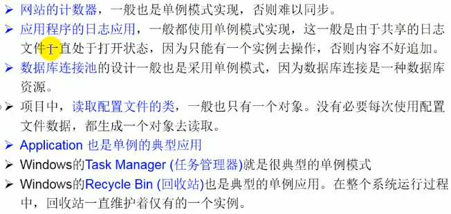

## 第二章 设计模式（单例设计模式）

### 设计模式

`设计模式`（Design pattern）是一套被`反复使用`、`多数人知晓`的、经过`分类编目`的、`代码设计经验`的总结。

**使用设计模式是为了可重用代码、让代码更容易被他人理解、保证代码可靠性**。 毫无疑问，设计模式于己于他人于系统都是多赢的，设计模式使代码编制真正工程化，设计模式是软件工程的基石，如同大厦的一块块砖石一样。项目中合理的运用设计模式可以完美的解决很多问题，每种模式在现在中都有相应的原理来与之对应，每一个模式描述了一个在我们周围不断重复发生的问题，以及该问题的核心解决方案，这也是它能被广泛应用的

#### 2.单例模式

#####  要解决的问题：

所谓类的单例设计模式，就是采取一定的方法保证在整个的软件系统中，对某个类只能存在一个对象实例。

##### 实现

##### 饿汉式1：

**先造好。直接造好**

```java
class Bank（）
{
// 1、私有化类的构造器
	private Bank（）
	{
	
	}
	//2.内部创建类的对象
	//4.要求此对象也必须声明为静态的
	private static Bank instance = new Bank();
	
	//3.提供公共的静态的方法，返回类的对象
	public static Bank getInstance(){
		return instance;
	}
	
}
```

##### 思考：

只有一个实例，即使再new 一个也是指向同一块地址。

Bank  bank =  Bank.getInstance( );


##### 懒汉式：

**啥时候用，啥时候造。**

```java
class Order{
	
	//1.私化类的构造器
	private Order(){
		
	}
	//2.声明当前类对象，没初始化
	//4.此对象也必须声明为static的
	private static Order instance = null;
	//3.声明public、static的返回当前类对象的方法
	public static Order getInstance(){
		if(instance == null){
			instance = new Order();
		}
		return instance;
	}
	
}
```


##### 区别饿汉、懒汉

 * 饿汉式：	

   坏处：对象加载时间过长

   好处：饿汉式是线程安全的

   

 * 懒汉式：

   好处：延迟对象的创建。

   目前的写法坏处：线程不安全。--->到多线程内容时，再修改

##### 使用场景



