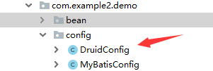
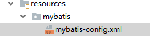
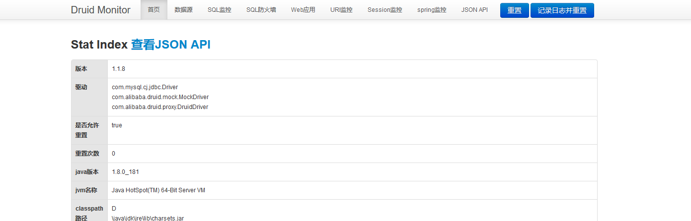
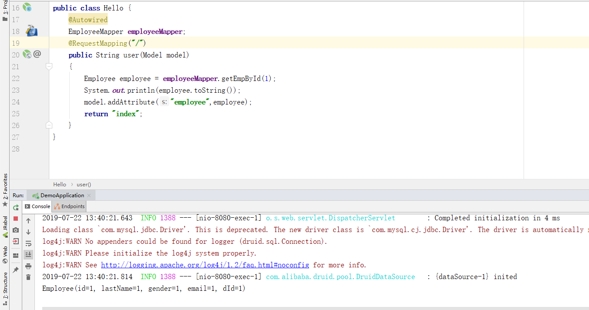
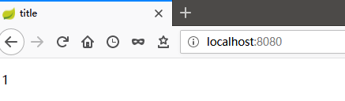
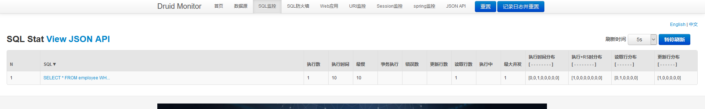

# Spring Boot + Mybatis+Druid 整合

  * [Spring Boot + Mybatis+Druid 整合](#spring-boot--mybatisdruid-整合)
    * [1、新建项目](#1、新建项目)
    * [2、新建application.yml 修改相关配置](#2、新建applicationyml-修改相关配置)
      * [数据源基本配置](#数据源基本配置)
      * [数据源其他配置](#数据源其他配置)
      * [配置监控统计拦截的filters，去掉后监控界面sql无法统计，'wall'用于防火墙](#配置监控统计拦截的filters，去掉后监控界面sql无法统计，wall用于防火墙)
      * [指定全局配置文件位置](#指定全局配置文件位置)
      * [指定sql映射文件位置](#指定sql映射文件位置)
    * [3、新建config包进行配置Druid](#3、新建config包进行配置druid)
    * [4 、resources 目录下配置mybatis-config.xml](#4-、resources-目录下配置mybatis-configxml)
    * [**5、配置相应的实体类、mapper、mapper.xml**](#5、配置相应的实体类、mapper、mapperxml)
    * [6、测试](#6、测试)

### 1、新建项目

idea 新建项目，添加 Web Starter、MySQL Driver、JDBC  APl、Mybatis Framework

pom.xml:

```xml
    <dependencies>
        <dependency>
            <groupId>org.springframework.boot</groupId>
            <artifactId>spring-boot-starter-jdbc</artifactId>
        </dependency>
        <dependency>
            <groupId>org.springframework.boot</groupId>
            <artifactId>spring-boot-starter-web</artifactId>
        </dependency>
        <dependency>
            <groupId>org.mybatis.spring.boot</groupId>
            <artifactId>mybatis-spring-boot-starter</artifactId>
            <version>2.1.0</version>
        </dependency>

        <dependency>
            <groupId>mysql</groupId>
            <artifactId>mysql-connector-java</artifactId>
            <scope>runtime</scope>
        </dependency>
        <dependency>
            <groupId>org.projectlombok</groupId>
            <artifactId>lombok</artifactId>
            <optional>true</optional>
        </dependency>
        <dependency>
            <groupId>org.springframework.boot</groupId>
            <artifactId>spring-boot-starter-test</artifactId>
            <scope>test</scope>
        </dependency>
        <!--引入druid-->
        <!-- https://mvnrepository.com/artifact/com.alibaba/druid -->
        <dependency>
            <groupId>com.alibaba</groupId>
            <artifactId>druid</artifactId>
            <version>1.1.8</version>
        </dependency>


        <dependency>
            <groupId>org.springframework.boot</groupId>
            <artifactId>spring-boot-starter-test</artifactId>
            <scope>test</scope>
        </dependency>
        <dependency>
            <groupId>net.minidev</groupId>
            <artifactId>json-smart</artifactId>
            <version>2.2.1</version>
        </dependency>
        <dependency>
            <groupId>log4j</groupId>
            <artifactId>log4j</artifactId>
            <version>1.2.17</version>
        </dependency>
        <dependency>
            <groupId>org.springframework.boot</groupId>
            <artifactId>spring-boot-starter-thymeleaf</artifactId>
        </dependency>
    </dependencies>

    <build>
        <plugins>
            <plugin>
                <groupId>org.springframework.boot</groupId>
                <artifactId>spring-boot-maven-plugin</artifactId>
            </plugin>
        </plugins>
    </build>
```

### 2、新建application.yml 修改相关配置

```yaml
spring:
  datasource:
#   数据源基本配置
    username: root
    password: root
    driver-class-name: com.mysql.jdbc.Driver
    url: jdbc:mysql://localhost:3306/spring?serverTimezone=UTC&characterEncoding=utf-8
    type: com.alibaba.druid.pool.DruidDataSource
#   数据源其他配置
    initialSize: 5
    minIdle: 5
    maxActive: 20
    maxWait: 60000
    timeBetweenEvictionRunsMillis: 60000
    minEvictableIdleTimeMillis: 300000
    validationQuery: SELECT 1 FROM DUAL
    testWhileIdle: true
    testOnBorrow: false
    testOnReturn: false
    poolPreparedStatements: true
#   配置监控统计拦截的filters，去掉后监控界面sql无法统计，'wall'用于防火墙
    filters: stat,wall,log4j
    maxPoolPreparedStatementPerConnectionSize: 20
    useGlobalDataSourceStat: true
    connectionProperties: druid.stat.mergeSql=true;druid.stat.slowSqlMillis=500
mybatis:
  # 指定全局配置文件位置
  config-location: classpath:mybatis/mybatis-config.xml
  # 指定sql映射文件位置
  mapper-locations: classpath:mybatis/mapper/*.xml
```

### 3、新建config包进行配置Druid



**Druid的简介**

Druid首先是一个数据库连接池。Druid是目前最好的数据库连接池，在功能、性能、扩展性方面，都超过其他数据库连接池，包括DBCP、C3P0、BoneCP、Proxool、JBoss   DataSource。Druid已经在阿里巴巴部署了超过600个应用，经过一年多生产环境大规模部署的严苛考验。Druid是阿里巴巴开发的号称为监控而生的数据库连接池！

同时Druid不仅仅是一个数据库连接池，它包括四个部分：

**Druid是一个JDBC组件，它包括三个部分：**

​    基于Filter－Chain模式的插件体系。

​    DruidDataSource 高效可管理的数据库连接池。

​    SQLParser

**Druid的功能**

1、替换DBCP和C3P0。Druid提供了一个高效、功能强大、可扩展性好的数据库连接池。

2、可以监控数据库访问性能，Druid内置提供了一个功能强大的StatFilter插件，能够详细统计SQL的执行性能，这对于线上分析数据库访问性能有帮助。

3、数据库密码加密。直接把数据库密码写在配置文件中，这是不好的行为，容易导致安全问题。DruidDruiver和DruidDataSource都支持PasswordCallback。

4、SQL执行日志，Druid提供了不同的LogFilter，能够支持Common-Logging、Log4j和JdkLog，你可以按需要选择相应的LogFilter，监控你应用的数据库访问情况。

5、扩展JDBC，如果你要对JDBC层有编程的需求，可以通过Druid提供的Filter机制，很方便编写JDBC层的扩展插件。

所以Druid可以：
1、充当数据库连接池。
2、可以监控数据库访问性能
3、获得SQL执行日志

参考自博客：https://blog.csdn.net/past__time/article/details/80486117

DruidConfig

```java
import com.alibaba.druid.pool.DruidDataSource;
import com.alibaba.druid.support.http.StatViewServlet;
import com.alibaba.druid.support.http.WebStatFilter;
import org.springframework.boot.context.properties.ConfigurationProperties;
import org.springframework.boot.web.servlet.FilterRegistrationBean;
import org.springframework.boot.web.servlet.ServletRegistrationBean;
import org.springframework.context.annotation.Bean;
import org.springframework.context.annotation.Configuration;

import javax.sql.DataSource;
import java.util.Arrays;
import java.util.HashMap;
import java.util.Map;

@Configuration
public class DruidConfig {

    @ConfigurationProperties(prefix = "spring.datasource")
    @Bean
    public DataSource druid(){
        return  new DruidDataSource();
    }

    //配置Druid的监控
    //1、配置一个管理后台的Servlet
    @Bean
    public ServletRegistrationBean statViewServlet(){
        ServletRegistrationBean bean = new ServletRegistrationBean(new StatViewServlet(), "/druid/*");
        Map<String,String> initParams = new HashMap<>();

        initParams.put("loginUsername","admin");
        initParams.put("loginPassword","123456");
        initParams.put("allow","");
        //默认就是允许所有访问
        initParams.put("deny","192.168.15.21");

        bean.setInitParameters(initParams);
        return bean;
    }


    //2、配置一个web监控的filter
    @Bean
    public FilterRegistrationBean webStatFilter(){
        FilterRegistrationBean bean = new FilterRegistrationBean();
        bean.setFilter(new WebStatFilter());

        Map<String,String> initParams = new HashMap<>();
        initParams.put("exclusions","*.js,*.css,/druid/*");

        bean.setInitParameters(initParams);

        bean.setUrlPatterns(Arrays.asList("/*"));

        return  bean;
    }
}
```

MybatisConfig：

```java
import org.apache.ibatis.session.Configuration;
import org.mybatis.spring.boot.autoconfigure.ConfigurationCustomizer;
import org.springframework.context.annotation.Bean;

@org.springframework.context.annotation.Configuration
public class MyBatisConfig {

    @Bean
    public ConfigurationCustomizer configurationCustomizer(){
        return new ConfigurationCustomizer(){

            @Override
            public void customize(Configuration configuration) {
                configuration.setMapUnderscoreToCamelCase(true);
                //打开驼峰命名映射
                //  mybatis自定义的SQL语句中，如select语句，如果数据库表的字段为驼峰命名，即如img_address这样的形式，那么select语句执行的结果会变成null。解决办法是在配置文件中加上开启驼峰映射的配置信息。
                //实体类中的字段命名为headUrl(head_url, 去除下划线，后面首字母大写)。
            }
        };
    }
}
```

### 4 、resources 目录下配置mybatis-config.xml



```xml
<?xml version="1.0" encoding="UTF-8" ?>
<!DOCTYPE configuration
        PUBLIC "-//mybatis.org//DTD Config 3.0//EN"
        "http://mybatis.org/dtd/mybatis-3-config.dtd">
<configuration>

    <settings>
        <setting name="mapUnderscoreToCamelCase" value="true"/>
    </settings>
</configuration>
```

### **5、配置相应的实体类、mapper、mapper.xml**

实体类：

```java
@Data
public class Employee {

    private Integer id;
    private String lastName;
    private Integer gender;
    private String email;
    private Integer dId;
    }
```

**mapper**

记得写mapper 注解或者在主函数中加：@MapperScan(value = "com.example2.demo.mapper")

即mapper包所在的位置

```java
import org.apache.ibatis.annotations.Mapper;

@Mapper
public interface EmployeeMapper {

    public Employee getEmpById(Integer id);

    public void insertEmp(Employee employee);
}
```

mappe.xml

```xml
<?xml version="1.0" encoding="UTF-8" ?>
<!DOCTYPE mapper
        PUBLIC "-//mybatis.org//DTD Mapper 3.0//EN"
        "http://mybatis.org/dtd/mybatis-3-mapper.dtd">
<mapper namespace="com.example3.demo.mapper.EmployeeMapper">
    //注意修改 namespace 的包位置
   <!--    public Employee getEmpById(Integer id);

    public void insertEmp(Employee employee);-->
    <select id="getEmpById" resultType="com.example3.demo.bean.Employee">
        SELECT * FROM employee WHERE id=#{id}
    </select>

    <insert id="insertEmp">
        INSERT INTO employee(lastName,email,gender,d_id) VALUES (#{lastName},#{email},#{gender},#{dId})
    </insert>
</mapper>
```

### 6、测试

新建controller

```java
import org.springframework.beans.factory.annotation.Autowired;
import org.springframework.stereotype.Controller;
import org.springframework.ui.Model;
import org.springframework.web.bind.annotation.RequestMapping;

/**
 * @author : dk
 * @date : 2019/7/22 00:42
 * @description :
 */
@Controller
public class Hello {
    @Autowired
    EmployeeMapper employeeMapper;
    @RequestMapping("/")
    public String  user(Model model)
    {
        Employee employee = employeeMapper.getEmpById(1);
        System.out.println(employee.toString());
        model.addAttribute("employee",employee);
        return "index";
    }
}
```

编写index.html

```html
<!DOCTYPE HTML>
<html xmlns:th="http://www.thymeleaf.org">
<head>
    <title>title</title>
    <meta http-equiv="Content-Type" content="text/html; charset=UTF-8"/>
</head>

<body>
    <p th:text="${employee.id}"></p>
</body>
</html>
```

输入在DruidConfig配置中的密码即可查看



**运行项目之后**





查看druid **************控制台**********

http://localhost:8080/druid/login.html




至此完成配置
