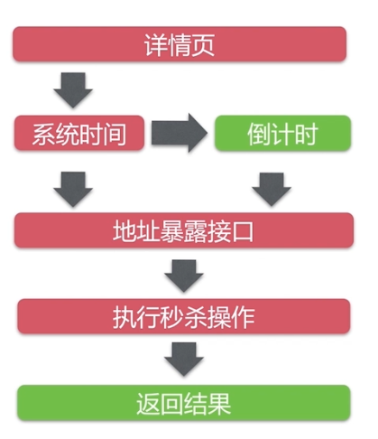
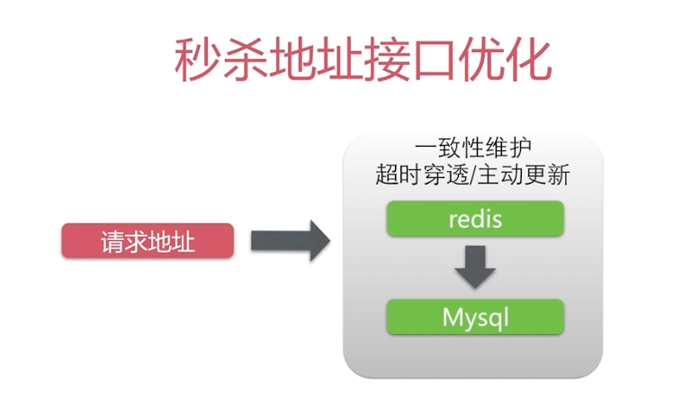
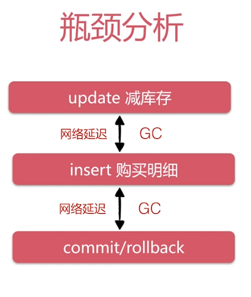
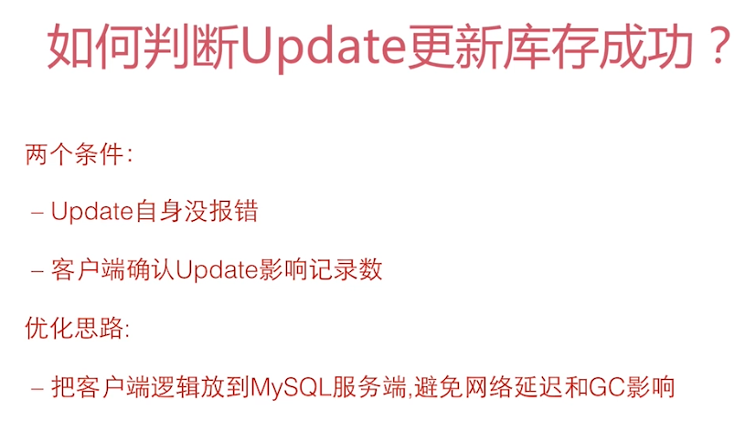
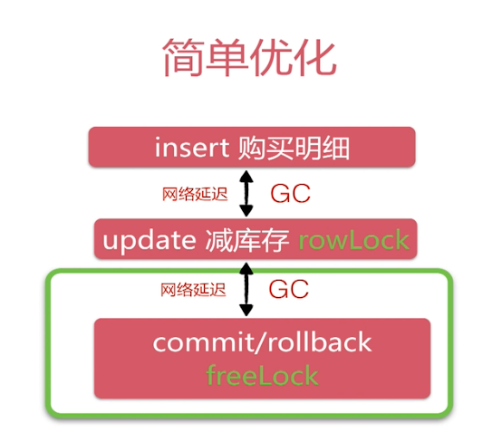
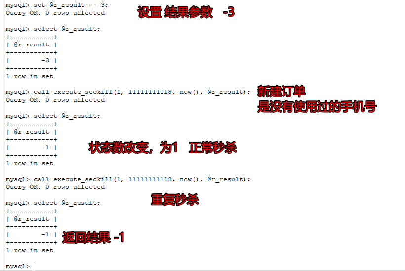

## Spring Boot秒杀系统（四）高并发优化

项目地址：https://github.com/wannengdek/SpringBoot-Seckill

如果项目对您有所帮助，麻烦帮忙点亮小⭐⭐

### 并发发生在哪？

红色部分为可能出现高并发的点




#### 秒杀地址接口分析可以放到服务端进下行缓存。



**当缓存中有地址时，直接返回。没有的话再去数据库进行查找，减轻数据库的压力。**


### 秒杀瓶颈分析



多个用户购买一个商品时，数据库对某行记录进行封锁，只有当前面的请求提交或者回滚之后才能进下释放，这就导致了后面的用户一直在等待。

**优化方向就是减少行级锁的持有时间**




### 优化总结

前端： 动静态数据做分离，减少请求与响应时间；按钮防重复，防止用户发送无效的重复请求，因为秒杀活动一般都会有购买数量的限制，敲的次数再多，最后还是要查看是否已购。影响了效率，可有前端代为处理并优化

后端：使用CDN换存重要的静态资源等；在后端对活动结束时间、商品选购时间、业务的相关逻辑要求都放在后端代码中，并调用缓存来进行暂存，已减少对DB的直接操作，提高效率


### 使用redis 进行缓存以减少请求数据库查询的次数


#### RedisDao  来控制秒杀对象是否放入缓存中

```java

@Repository
public class RedisDao {

    private final Logger logger = LoggerFactory.getLogger(this.getClass());

    @Autowired
    JedisPool jedisPool;


//    public RedisDao(String host, int port) {
//        jedisPool = new JedisPool(host, port);
//    }

    private RuntimeSchema<Seckill> schema = RuntimeSchema.createFrom(Seckill.class);

    public Seckill getSeckill(Integer seckillId) {
        // Redis 操作逻辑
        try {
//           Jedis jedis = jedisPool.getResource();

            Jedis jedis = jedisPool.getResource();
            try {
                String key = "seckill:" + seckillId;
                // 并没有实现内部序列化操作，采用自定义序列化
                // get-》byte【】 -》 反序列化 -》 Object （seckill）
                // protostuff:pojo
                byte[] bytes = jedis.get(key.getBytes());
                // 缓冲重获取到
                if (bytes != null) {
                    //空对象
                    Seckill seckill = schema.newMessage();
                    ProtostuffIOUtil.mergeFrom(bytes, seckill, schema);
                    // seckill 被反序列化
                    return seckill;
                }
            } finally {
                jedis.close();
            }
        } catch (Exception e) {
            logger.error(e.getMessage(), e);
        }
        return null;
    }

    public String putSeckill(Seckill seckill) {
        // set Object(Seckill) -> 序列化 -> byte[]
        try {
            Jedis jedis = jedisPool.getResource();
            try {
                String key = "seckill:" + seckill.getSeckillId();
                byte[] bytes = ProtostuffIOUtil.toByteArray(seckill, schema,
                        LinkedBuffer.allocate(LinkedBuffer.DEFAULT_BUFFER_SIZE));
                // 超时缓存
                int timeout = 60 * 60;
                // 1小时
                String result = jedis.setex(key.getBytes(), timeout, bytes);
                return result;
            } finally {
                jedis.close();
            }
        } catch (Exception e) {
            logger.error(e.getMessage(), e);
        }
        return null;
    }

}
```


#### redis 的相关配置

```java
@Configuration
public class JedisConfig {
    private Logger logger = LoggerFactory.getLogger(JedisConfig.class);

    @Value("${spring.redis.host}")
    private String host;

    @Value("${spring.redis.port}")
    private int port;

    @Value("${spring.redis.timeout}")
    private int timeout;


    @Bean
    public JedisPool redisPoolFactory(){
        JedisPoolConfig jedisPoolConfig = new JedisPoolConfig();

        JedisPool jedisPool = new JedisPool(jedisPoolConfig, host, port, timeout, null);

        logger.info("JedisPool注入成功");
        logger.info("redis地址：" + host + ":" + port);
        return jedisPool;
    }
}
```

#### 测试

```java
    @Autowired
    RedisDao redisDao;

    private Integer id =1;

    @Test
    public void Seckill() {
//        get and put
        Seckill seckill = redisDao.getSeckill(id);
        if (seckill == null)
        {
            seckill = seckillMapper.queryById(id);
            if(seckill != null)
            {
                String result = redisDao.putSeckill(seckill);
                System.out.println(result);
                seckill = redisDao.getSeckill(id);
                System.out.println(seckill);
            }
        }
    }
```


### 要降低mysql 行锁的持有时间

#### 更改sql语句执行顺序




#### 通过存储过程来执行秒杀逻辑

#### seckill-transaction.sql

```sql
-- 秒杀执行存储过程

DELIMITER $$ -- console ; 转换为 $$
-- 定义存储过程
-- 参数： in 输入参数； out 输出参数
-- row_count(): 返回上一条修改类型sql的影响行数
--             0:未修改数据； >0 表示修改的行数； <0 表示sql错误/未执行修改
CREATE PROCEDURE `spring`.`execute_seckill`( IN v_seckill_id INT , IN v_phone VARCHAR(255) , IN v_kill_time TIMESTAMP , OUT r_result INT )
BEGIN
    DECLARE
	insert_count INT DEFAULT 0;
    START TRANSACTION;
    INSERT IGNORE INTO success_killed
     ( seckill_id, user_phone, create_time )
    VALUES
	( v_seckill_id, v_phone, v_kill_time );
SELECT
	ROW_COUNT( ) INTO insert_count;
IF
	( insert_count = 0 ) THEN
	ROLLBACK;

SET r_result = - 1;

ELSEIF ( insert_count < 0 ) THEN
ROLLBACK;

SET r_result = - 2;

ELSE
 UPDATE seckill
SET number = number - 1
WHERE
	seckill_id = v_seckill_id
	AND end_time > v_kill_time
	AND start_time < v_kill_time AND number > 0;

SELECT
	ROW_COUNT( ) INTO insert_count;
IF
	( insert_count = 0 ) THEN
		ROLLBACK;

	SET r_result = 0;

	ELSEIF ( insert_count < 0 ) THEN
	ROLLBACK;

	SET r_result = - 2;

	ELSE COMMIT;
	SET r_result = 1;

END IF;

END IF;

END;
$$
-- 存储过程定义结束


set @r_result = -3;
call execute_seckill(1, 11111111118, now(), @r_result);

select @r_result;
-- 获取结果

-- 存储过程
-- 1：存储过程优化：事务行级锁持有时间
-- 2：不要过度依赖存储过程
-- 3：简单的逻辑可以应用存储过程
-- 4：QPS：一个秒杀单6000/qps-- 秒杀执行过程

```


#### 执行结果



