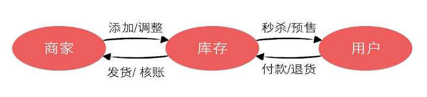
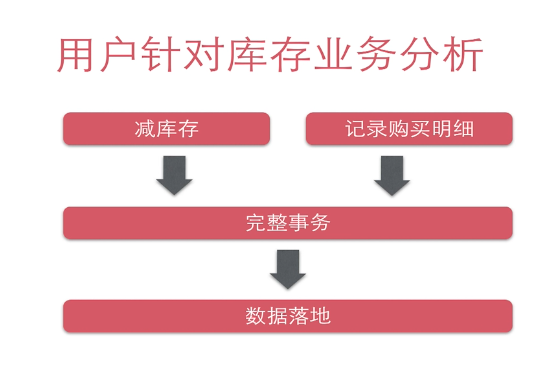
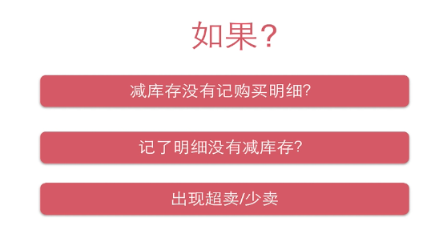
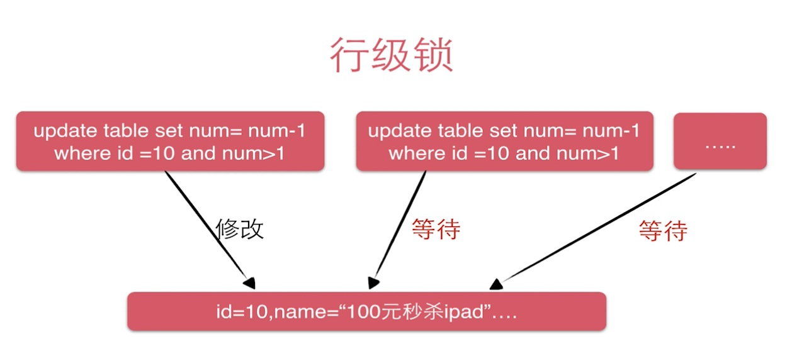
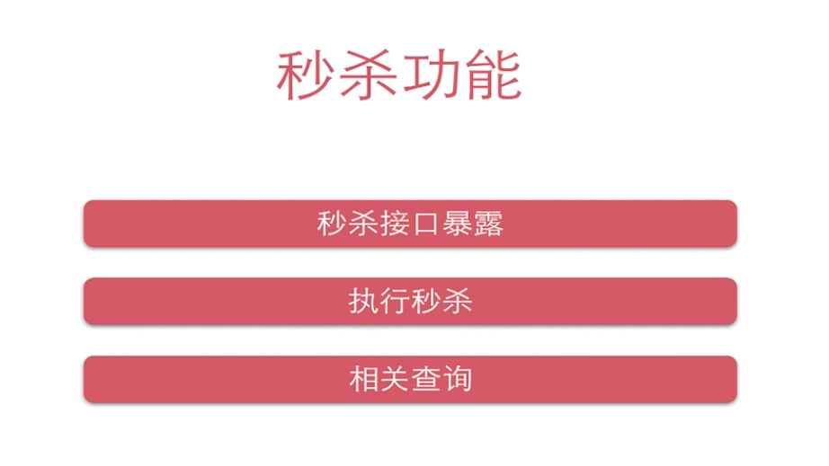
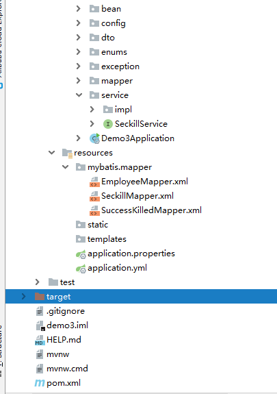
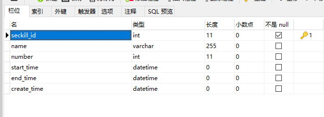
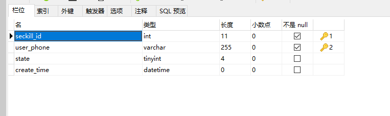

## SpringBoot秒杀体统（一）Dao 层

[学习自慕课网](https://www.imooc.com/u/2145618/courses?sort=publish)，原项目为SSM，现改造为springboot项目。

### 秒杀系统业务流程

1、问题在于如何不超卖、使用户如何不超买。






可能出现的问题：



#### 难点分析：

使用事务+ 行级锁来约束购买

##### 事务：

*数据库*管理系统执行过程中的一个逻辑单位，由一个有限的*数据库*操作序列构成。   

通过开始事务、更新库存数量、插入购买记录、提交   来完成对一个用户的秒杀商品过程。

##### 行级锁：

当一个用户完成购买之后，下一个用户才能继续使用这条秒杀商品记录。



### 秒杀功能实现



### 整体项目分类一览



### Dao层编写

Dao层，也就是数据层，在ssm的项目中常用dao 这个包来存放相关数据，在springboot项目中，使用mapper来进行数据的交互。

关于如何 创建一个springboot+mybatis 项目，可以查看这个：[Spring Boot + Mybatis+druid 整合](https://blog.csdn.net/qq_41852212/article/details/96858050)

#### 1、数据库编写

seckill 表    用来记录 需要秒杀的商品



sucess_killed 表    用来记录成功秒杀的记录



SQL 语句

```sql
DROP TABLE IF EXISTS `seckill`;
CREATE TABLE `seckill` (
  `seckill_id` int(11) NOT NULL,
  `name` varchar(255) DEFAULT NULL,
  `number` int(11) DEFAULT NULL,
  `start_time` datetime DEFAULT NULL,
  `end_time` datetime DEFAULT NULL,
  `create_time` datetime DEFAULT NULL,
  PRIMARY KEY (`seckill_id`),
  KEY `idx_start_time` (`start_time`),
  KEY `idx_end_time` (`end_time`),
  KEY `idx_create_time` (`create_time`)
) ENGINE=InnoDB DEFAULT CHARSET=utf8;


DROP TABLE IF EXISTS `success_killed`;
CREATE TABLE `success_killed` (
  `seckill_id` int(11) NOT NULL COMMENT '秒杀商品id',
  `user_phone` varchar(255) NOT NULL,
  `state` tinyint(4) DEFAULT '-1' COMMENT '-1：无效，0：成功，1：已付款',
  `create_time` datetime DEFAULT NULL,
  PRIMARY KEY (`seckill_id`,`user_phone`),
  KEY `idx_create_time` (`create_time`)
) ENGINE=InnoDB DEFAULT CHARSET=utf8;
```

bean 的实体类就不贴代码了。

需要注意的是在 SuccessKilled 这个类中加一行

```java
  private Seckill seckill;
```

SeckillMapper：

```java
    /**
     *  根据id查看当前秒杀的商品
     * @param seckillId
     * @return
     */
    Seckill queryById(@Param("seckillId") Integer seckillId);

    /**
     * 根据所给参数查询 秒杀的商品
     * @param offset
     * @param limit
     * @return
     */
    List<Seckill> queryAll(@Param("offset")Integer offset , @Param("limit")Integer limit);

    /**
     *  给当前商品的库存 -1
     * @param seckillId
     * @param killTime
     * @return
     */
    int reduceNumber(@Param("seckillId") long seckillId, @Param("killTime") Date killTime);
```

SeckillMapper.xml：

```xml
<?xml version="1.0" encoding="UTF-8" ?>
<!DOCTYPE mapper
        PUBLIC "-//mybatis.org//DTD Mapper 3.0//EN"
        "http://mybatis.org/dtd/mybatis-3-mapper.dtd">
<mapper namespace="com.example.demo3.mapper.SeckillMapper">

    <!--    //注意修改 namespace 的包位置-->
    <select id="queryById" resultType="com.example.demo3.bean.Seckill">
  select * from seckill where seckill_id = #{seckillId}
</select>

    <select id="queryAll" resultType="com.example.demo3.bean.Seckill">
  select * from seckill
  order by create_time desc limit #{offset},#{limit}
</select>


    <update id="reduceNumber">
        UPDATE seckill
        SET number = number-1
        WHERE seckill_id=#{seckillId}
        AND start_time <![CDATA[ <= ]]> #{killTime}
        AND end_time >= #{killTime}
        AND number > 0;
    </update>

</mapper>
```

SuccessKilledMapper：

```java
/**
    * 插入一条秒杀记录
    * @param seckillId
    * @param userPhone
    * @return
    */
   int insertSuccessKilled(@Param("seckillId") Integer seckillId,@Param("userPhone") String userPhone);

   /**
    * 根据seckillId查询SuccessKilled对象，并携带Seckill对象
    * @param seckillId
    * @param userPhone
    * @return
    */
   SuccessKilled queryByIdWithSeckill(@Param("seckillId") Integer seckillId, @Param("userPhone") String userPhone);


```

SuccessKilledMapper.xml

主要是两个sql语句的编写，第一个是很多人都抢购一个商品时，容易出现重复秒杀的情况。此时使用ignore 使程序不报错。

对于第二个语句，是将 购买成功记录查询出来时 带上 秒杀商品的相关属性。

```xml
<?xml version="1.0" encoding="UTF-8" ?>
<!DOCTYPE mapper
        PUBLIC "-//mybatis.org//DTD Mapper 3.0//EN"
        "http://mybatis.org/dtd/mybatis-3-mapper.dtd">
<mapper namespace="com.example.demo3.mapper.SuccessKilledMapper">

    <insert id="insertSuccessKilled">
        <!--当出现主键冲突时(即重复秒杀时)，会报错;不想让程序报错，加入ignore-->
        INSERT ignore INTO success_killed(seckill_id,user_phone,state)
        VALUES (#{seckillId},#{userPhone},0)
    </insert>

    <select id="queryByIdWithSeckill" resultType="com.example.demo3.bean.SuccessKilled">

        <!--根据seckillId查询SuccessKilled对象，并携带Seckill对象-->
        <!--如何告诉mybatis把结果映射到SuccessKill属性同时映射到Seckill属性-->
        <!--可以自由控制SQL语句-->
        SELECT
        sk.seckill_id,
        sk.user_phone,
        sk.create_time,
        sk.state,
        s.seckill_id "seckill.seckill_id",
        s.name "seckill.name",
        s.number "seckill.number",
        s.start_time "seckill.start_time",
        s.end_time "seckill.end_time",
        s.create_time "seckill.create_time"
        FROM success_killed sk
        INNER JOIN seckill s ON sk.seckill_id=s.seckill_id
        WHERE sk.seckill_id=#{seckillId}
        AND sk.user_phone=#{userPhone}
    </select>

</mapper>
```

#### 2、相关测试：

```java
@RunWith(SpringRunner.class)
@SpringBootTest
public class Demo3ApplicationTests {

    @Autowired
    EmployeeMapper employeeMapper;

    @Autowired
    SeckillMapper seckillMapper;

    @Test
    public void reduceNumber() {
        Date date = new Date();
        int up = seckillMapper.reduceNumber(1,date);
        System.out.println(up);
    }

    @Test
    public void queryById() {
        seckillMapper.queryById(1);
        System.out.println(1);
    }
    @Test
    public void queryAll() {
        List<Seckill > seckills = seckillMapper.queryAll(1,10);
        for (int i = 0; i <seckills.size() ; i++) {
            System.out.println(seckills.get(i).toString());
        }
    }
}
```


