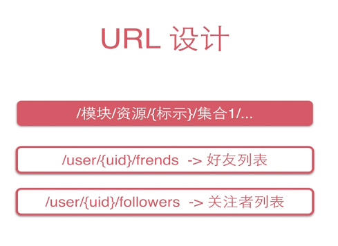
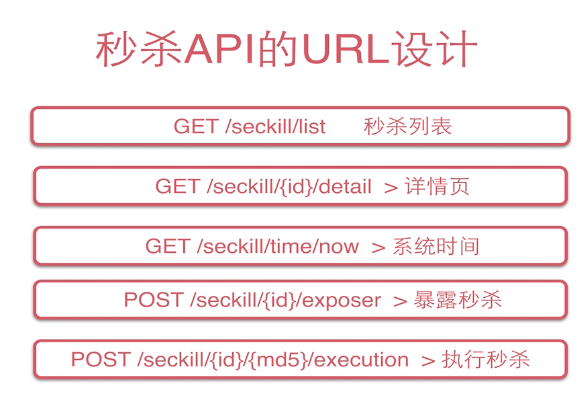
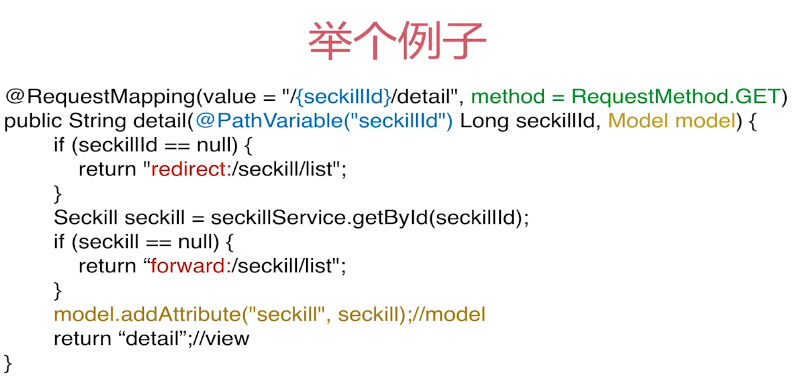
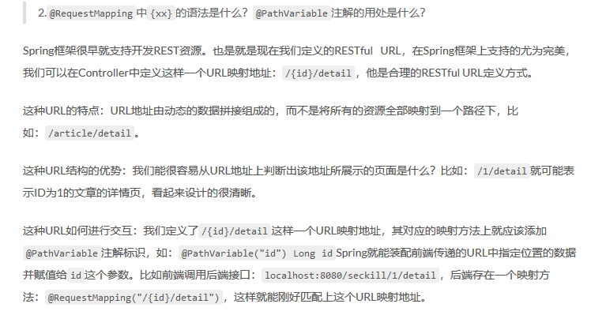
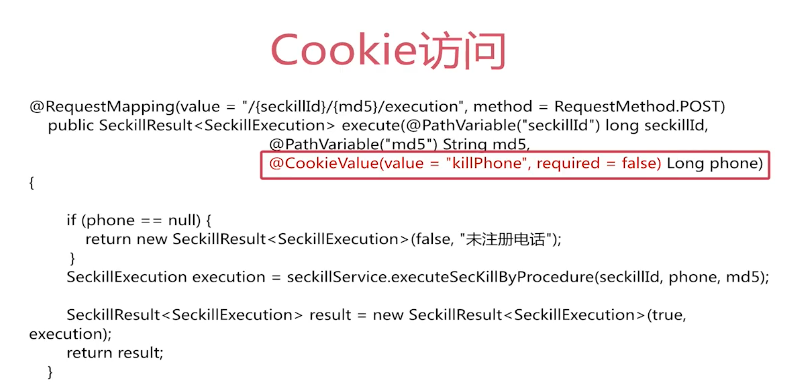

## SpringBoot秒杀系统（三）web 层

因为每个用户的时间可能并不统一，所以要使用服务器时间来统一秒杀开始时间，首先获取服务器时间，秒杀开始前是无法得到秒杀地址的，开始之后可以得到秒杀地址。


### Restful 接口规范

[RESTful](http://www.ruanyifeng.com/blog/2011/09/restful.html) 是目前最流行的 API 设计规范，用于 Web 数据接口的设计。

RESTful 的核心思想就是，客户端发出的数据操作指令都是"动词 + 宾语"的结构。比如，`GET /articles`这个命令，`GET`是动词，`/articles`是宾语。


#### Restful URL设计



### 秒杀API 的URL 设计



应该去培养一个良好的接口规范。

### 注解映射


### 请求方法细节处理







### 前端页面设计


本项目使用Cookie存储用户手机号的方式模拟用户登录功能，实际上没有与后端交互的操作。如果用户没有登录就打开了商品详情页会直接弹出一个手机号登录框提醒用户登录，且没有登录时无法关闭登录框的。



#### 所用技术

1. HTML页面，用Bootstrap绘制。
2. Thymeleaf模板引擎渲染HTML页面，使得HTML页面拥有类似JSP页面一样功能。
3. JS方面使用原生的JQuery。

使用 js来从后端获取对应的值，使用thymeleaf 以及js 的相关函数控制页面的数据显示以及各种控件的显示。


#### seckill_detail.js

负责验证手机号、处理秒杀逻辑、详情页秒杀逻辑、计时等功能

```javascript
// JavaScript模块化
var seckill = {
    //封装秒杀相关的ajax的url地址
    URL: {
        now: function () {
            return '/seckill/time/now';
        },
        exposer: function(seckillId){
            return '/seckill/' + seckillId + '/exposer';
        },
        execution : function(seckillId, md5){
            return '/seckill/' + seckillId + '/' + md5 + '/execution';
        }
    },
    //验证手机号
    validatePhone: function (phone) {
        if (phone && phone.length == 11 && !isNaN(phone)) {
            return true;
        } else {
            return false;
        }
    },
    //处理秒杀逻辑
    handleSeckill: function(seckillId, node){
        //获取秒杀地址，控制显示逻辑，执行秒杀
        node.hide().html('<button class="btn btn-primary btn-lg" id="killBtn">开始秒杀</button>');
        $.post(seckill.URL.exposer(seckillId), {}, function(result){
            //在回调函数中执行交互流程
            if (result && result['success']){
                var exposer = result['data'];
                if (exposer['exposed']){
                    //开启秒杀
                    var md5 = exposer['md5'];
                    var killUrl = seckill.URL.execution(seckillId, md5);
                    console.log('killUrl:' + killUrl);
                    console.log('exposer:' + exposer);
                    //one: 绑定一次点击事件
                    $('#killBtn').one('click', function(){
                        //执行秒杀的操作
                        //1. 先禁用按钮
                        $(this).addClass('disabled');
                        //2. 发送秒杀请求，执行秒杀
                        $.post(killUrl,function(result){
                            if (result && result['success']){
                                console.log(' if (result && result');
                                var killResult = result['data'];
                                var stateInfo = killResult['stateInfo'];
                                //3. 显示秒杀结果
                                node.html('<span class="label label-success">' + stateInfo + '</span>');
                            }
                        })
                    });
                    node.show();
                } else{
                    //未开启秒杀，避免用户得到的时间有偏差
                    var now = exposer['now'];
                    var start = exposer['start'];
                    var end = exposer['end'];
                    seckill.countdown(seckillId, now, start, end);
                }
            } else{
                console.log('result:' + result);
            }
        });
    },
    //计时
    countdown: function (seckillId, nowTime, startTime, endTime) {
        var seckillBox = $('#seckill-box');
        var seckillTimeSpan = $('#seckill-time-span');
        //时间判断
        if (nowTime > endTime){
            //秒杀结束
            seckillTimeSpan.html('秒杀结束');
            seckillBox.hide();
        }else if(nowTime < startTime){
            //说明秒杀未开始，计时事件绑定
            var killTime = new Date(startTime + 1000);
            seckillTimeSpan.countdown(killTime, function(event){
                //时间格式
                var format = event.strftime('秒杀开始倒计时：%D天 %H时 %M分 %S秒');
                seckillTimeSpan.html(format);
                //时间完成后回调事件
            }).on('finish.countdown', function(){
                //获取秒杀地址，控制实现逻辑，执行秒杀
                seckill.handleSeckill(seckillId, seckillBox );
            });
        }else{
            //秒杀开始
            seckill.handleSeckill(seckillId, seckillBox);
            //计时
            var killEndTime = new Date(endTime + 1000);
            seckillTimeSpan.countdown(killEndTime, function(event){
                //时间格式
                var format = event.strftime('距离秒杀结束： %D天 %H时 %M分 %S秒');
                seckillTimeSpan.html(format);
            });
        }
    },
    //详情页秒杀逻辑
    detail: {
        //详情页初始化
        init: function (params) {
            //1、进行手机验证
            //在cookie中查询用户
            var killPhone = $.cookie('killPhone');
            //验证手机号
            if (!seckill.validatePhone(killPhone)) {
                //绑定phone
                var killPhoneModal = $('#killPhoneModal');
                //控制输出
                killPhoneModal.modal({
                    show: true,
                    backdrop: 'static', //禁止位置关闭
                    keyboard: false //关闭键盘事件
                });
                $("#killPhoneBtn").click(function () {
                    var inputPhone = $('#killPhoneKey').val();

                    if (seckill.validatePhone(inputPhone)) {
                        //将手机号写入cookie
                        $.cookie('killPhone', inputPhone, {expires: 7, path: '/seckill/'});
                        //刷新页面
                        window.location.reload();
                    } else {
                        $("#killPhoneMessage").hide().html('<lable class="label label-danger">手机号错误！</lable>').show(300);
                    }
                });
            }
            //已经登录
            //计时交互
            var startTime = params['startTime'];
            var endTime = params['endTime'];
            var seckillId = params['seckillId'];

            $.get(seckill.URL.now(), {}, function (result) {
                if (result && result['success']) {
                    var nowTime = result['data'];
                    //时间判断
                    seckill.countdown(seckillId, nowTime, startTime, endTime);
                } else {
                    console.log('result:' + result);
                }
            });
        }
    }
};
```


### 最终效果

#### 主页面


#### 商品详情页面 （未登录）


#### 点击秒杀之后


#### 再次秒杀


没有错误数据产生，并且也提示了用户重复秒杀的问题。


部分内容参考自原视频ppt，以及：https://tycoding.cn/2018/10/14/ssm/seckill-web/