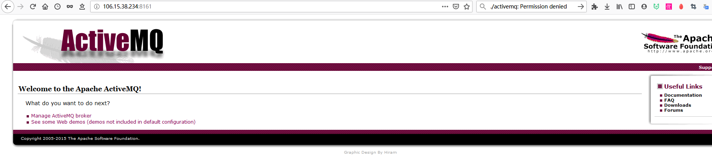
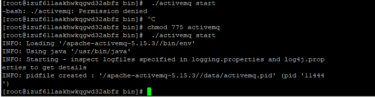
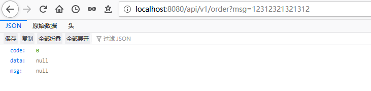
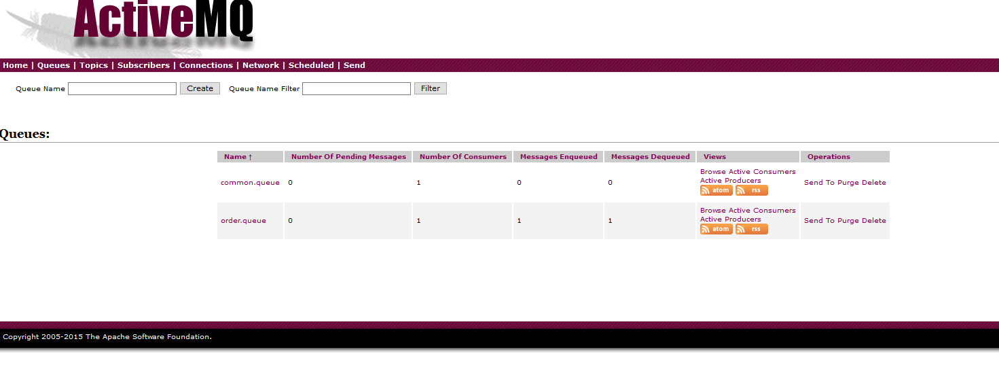

权限问题时：https://blog.csdn.net/shangdi1988/article/details/46573597

https://blog.csdn.net/DingnanDean/article/details/79438183

https://blog.csdn.net/qq_41852212/article/details/98490836

ptp和topic两种消息模式，可以理解为qq的私聊和群聊的关系