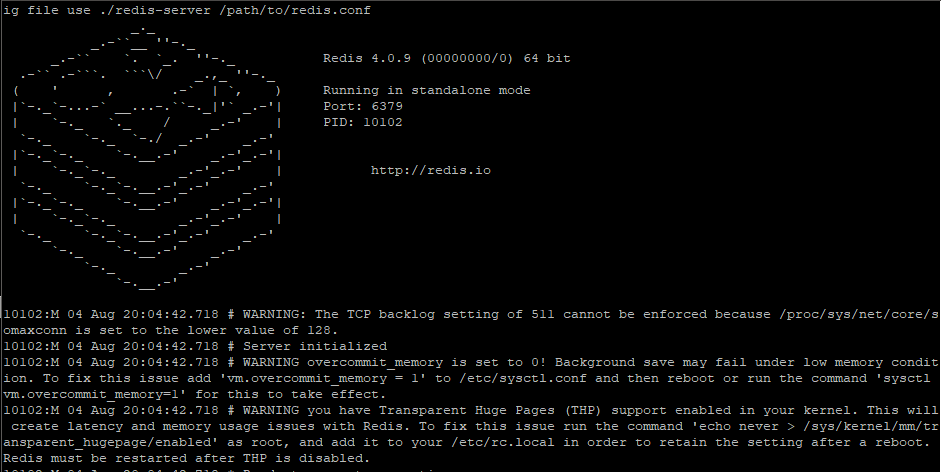

## SpringBoot配置redis

GitHub 地址：https://github.com/wannengdek/springboot-redis-linux

### 1、官方网站

https://redis.io/download

linux 配置

```
$ wget http://download.redis.io/releases/redis-5.0.5.tar.gz
$ tar xzf redis-5.0.5.tar.gz
$ cd redis-5.0.5
$ make
```


显示上图为成功安装

执行命令：cd src/              ./redis-server



redis 成功开启

 错误解决

https://www.cnblogs.com/Gnnnny/p/7851147.html


成功测试

### 2、本地安装redis

https://www.cnblogs.com/PollyLuo/p/9635324.html


### 3、使用springboot-starter整合reids实战

1、官网：https://docs.spring.io/spring-boot/docs/2.1.0.BUILD-SNAPSHOT/reference/htmlsingle/#boot-features-redis
			集群文档：https://docs.spring.io/spring-data/data-redis/docs/current/reference/html/#cluster

		2、springboot整合redis相关依赖引入
			<dependency>
	            <groupId>org.springframework.boot</groupId>
	            <artifactId>spring-boot-starter-data-redis</artifactId>
	        </dependency>


配置：

```
#=========redis基础配置=========
spring.redis.database=0
spring.redis.host=127.0.0.1
spring.redis.port=6379
# 连接超时时间 单位 ms（毫秒）
spring.redis.timeout=3000

#=========redis线程池设置=========
# 连接池中的最大空闲连接，默认值也是8。
spring.redis.pool.max-idle=200

#连接池中的最小空闲连接，默认值也是0。
spring.redis.pool.min-idle=200

# 如果赋值为-1，则表示不限制；pool已经分配了maxActive个jedis实例，则此时pool的状态为exhausted(耗尽)。
spring.redis.pool.max-active=2000

# 等待可用连接的最大时间，单位毫秒，默认值为-1，表示永不超时
spring.redis.pool.max-wait=1000
```

pom.xml

```
<dependency>
   <groupId>org.springframework.boot</groupId>
   <artifactId>spring-boot-starter-web</artifactId>
</dependency>
<dependency>
   <groupId>org.springframework.boot</groupId>
   <artifactId>spring-boot-devtools</artifactId>
   <optional>true</optional>
</dependency>

   <dependency>
           <groupId>org.springframework.boot</groupId>
           <artifactId>spring-boot-starter-data-redis</artifactId>
       </dependency>

<dependency>
   <groupId>org.springframework.boot</groupId>
   <artifactId>spring-boot-starter-test</artifactId>
   <scope>test</scope>
</dependency>
```

项目配置


RdisTestController

```java
@RestController
@RequestMapping("/api/v1/redis")
public class RdisTestController {
   @Autowired
   private StringRedisTemplate redisTpl;
   //jdbcTemplate
   @Autowired
   private RedisClient redis;
   @GetMapping(value="add")
   public Object add(){
      //redisTpl.opsForValue().set("name", "xdclass2018");
      redis.set("username", "xddddddd");
       //封装之后的set方法
      return JsonData.buildSuccess();
   }
   
   @GetMapping(value="get")
   public Object get(){
      //String value = redisTpl.opsForValue().get("name");
      String value = redis.get("username");
      return JsonData.buildSuccess(value);
   }
   
   @GetMapping(value="save_user")
   public Object saveUser(){
      User user = new User(1, "abc", "11", new Date());
      String userStr = JsonUtils.obj2String(user);
      boolean flag = redis.set("base:user:11", userStr);
      return JsonData.buildSuccess(flag);
      
   }
   
   @GetMapping(value="find_user")
   public Object findUser(){
      String userStr = redis.get("base:user:11");
      User user = JsonUtils.string2Obj(userStr, User.class);
      return JsonData.buildSuccess(user);
      
   }
   
   
}
```

RedisClient

```java
@Component
public class RedisClient {

   
   
   @Autowired
   private StringRedisTemplate redisTpl;
   //jdbcTemplate

   /**
    * 功能描述：设置key-value到redis中
    * @param key
    * @param value
    * @return
    */
   public boolean set(String key ,String value){
      try{
         redisTpl.opsForValue().set(key, value);
         return true;
      }catch(Exception e){
         e.printStackTrace();
         return false;
      }
   }

   /**
    * 功能描述：通过key获取缓存里面的值
    * @param key
    * @return
    */
   public String get(String key){
      return redisTpl.opsForValue().get(key);
   }
}
```


### 4、本地测试


localhost:8080/api/v1/redis/add


http://localhost:8080/api/v1/redis/get


save_user

```java
@GetMapping(value="save_user")
public Object saveUser(){
   User user = new User(1, "abc", "11", new Date());
   String userStr = JsonUtils.obj2String(user);
   boolean flag = redis.set("base:user:11", userStr);
   return JsonData.buildSuccess(flag);
   
}
```


### 5、线上测试

修改host  为自己的服务器地址


linux 在配置之后 需要在src 目录下 ./src/redis-server redis.conf

然后  ./redis-cli   进入到 redis 中


无法连接的错误解决：https://blog.csdn.net/michaelehome/article/details/79513002


