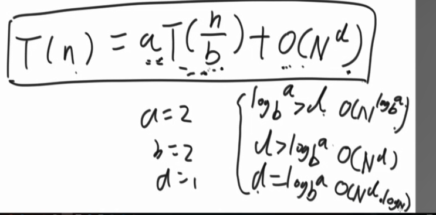
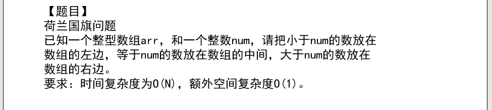

## 第一章

<!-- TOC -->autoauto- [第一章](#第一章)auto    - [时间复杂度](#时间复杂度)auto    - [排序](#排序)auto        - [交换函数](#交换函数)auto        - [冒泡](#冒泡)auto        - [逆序冒泡](#逆序冒泡)auto    - [对数器](#对数器)auto    - [直接插入排序](#直接插入排序)auto    - [选择排序](#选择排序)auto    - [三大排序   时间复杂度O(N*logN)](#三大排序---时间复杂度onlogn)auto        - [归并排序   空间复杂度O（N）](#归并排序---空间复杂度on)auto        - [快速排序O(log N)](#快速排序olog-n)auto    - [随机快速排序](#随机快速排序)auto    - [荷兰国旗问题](#荷兰国旗问题)auto    - [堆排序O(1)](#堆排序o1)auto    - [排序稳定性](#排序稳定性)autoauto<!-- /TOC -->


### 时间复杂度

### 排序

#### 交换函数

```java
	public static void swap(int[] arr, int i, int j) {
		int tmp = arr[i];
		arr[i] = arr[j];
		arr[j] = tmp;
	}
```

#### 冒泡

时间复杂度 O(n^2),额外空间复杂度O（1），可以做到稳定排序。

```java
public static void bubbleSort(int [] arr)
{
	if(arr==null||arr.lenth<2)
	{
		return;
	}
	for(int  i=0;i<arr.lenth-1;i++)
	{
		for(int j=0;j<n-i-1;j++)
		{
			if(a[i]>a[i+1])
			{
				swap(arr,i,i+1);
			}
		}
	}
	
}
```

#### 逆序冒泡

```java
    public static void dubbleSort(int [] arr)
    {
        for (int i=arr.length-1;i>0；i--)
        {
            //逆序比较
            for (int j=0;j<i;j++)
            {
                if (arr[j]>a[j+1])
                    //每两个比较一次 
                    swap(arr,j,j+1);
                
            }
            //第一趟排序中  0-n上全局最大值已经放在了最后
            //从  0----n-1 上继续比较
            //从  0----n-2  继续比较
        }
    }
    //54321
    //43215
    //32145
    //21345
    //12345    
```

### 对数器 

用于判断流程是否正确

```java
	public static int[] generateRandomArray(int maxSize, int maxValue) {

       //

		int[] arr = new int[(int) ((maxSize + 1) * Math.random())];

		for (int i = 0; i < arr.length; i++) {

			arr[i] = (int) ((maxValue + 1) * Math.random()) - (int) (maxValue * Math.random());

		}

		return arr;

	}
```

### 直接插入排序

最好 o（n）  最坏 o（n^2）辅助空间O（1）

优点是实现简单，不占用多余空间，但效率较低，并且经常需要交换数据。

```java
	public static void insertionSort(int[] arr) {
	if (arr == null || arr.length < 2) {
		return;
	}
	for (int i = 0; i < arr.length-1; i++) {
		for (int j = i; j >= 0 && arr[j] > arr[j + 1]; j--) {
			//每次比较前一位数是否大于当前数   一直循环到  arr[0]
			swap(arr, j, j + 1);
		}
	}
}
//外循环为
6324
    3624
    
    3264
    2364
    
    2346
    
```

外循环是 arr.lenth  假如数组中有5个元素，则 lenth=5，考虑到内循环是两两比较，并且每次要判断当前数与前面一个数进行比较。

每次比较将当前序列中的最大数放到最后，内层循环 j  -1，如果 j=0 ，继续判断 a[j] 与 a[j+1]的关系，当j=-1<0时，停止循环。

外循环为0，循环到lenth-1. 内循环为i，循环到0。

### 选择排序

```java
	public static void selectionSort(int[] arr) {
		if (arr == null || arr.length < 2) {
			return;
		}
		for (int i = 0; i < arr.length - 1; i++) {
			int minIndex = i;
			for (int j = i + 1; j < arr.length; j++) {
				minIndex = arr[j] < arr[minIndex] ? j : minIndex;
			}
			swap(arr, i, minIndex);
		}
	}
```


### 三大排序   时间复杂度O(N*logN)  

#### 归并排序   空间复杂度O（N）

```java
	public static void mergeSort(int[] arr) {
		if (arr == null || arr.length < 2) {
			return;
		}
		mergeSort(arr, 0, arr.length - 1);
	}

	public static void mergeSort(int[] arr, int l, int r) {
		if (l == r) {
			return;
		}
		int mid = l + ((r - l) >> 1);
		mergeSort(arr, l, mid);//左边排好
		mergeSort(arr, mid + 1, r);//右边排 好
		merge(arr, l, mid, r);//一起排 
	}

	public static void merge(int[] arr, int l, int m, int r) {
		int[] help = new int[r - l + 1];
		int i = 0;
		int p1 = l;
		int p2 = m + 1;
		while (p1 <= m && p2 <= r) {
			help[i++] = arr[p1] < arr[p2] ? arr[p1++] : arr[p2++];
		}
        //将新的数据进行比较  小的放进数据
		while (p1 <= m) {
			help[i++] = arr[p1++];
		}
		while (p2 <= r) {
			help[i++] = arr[p2++];
		}
		for (i = 0; i < help.length; i++) {
			arr[l + i] = help[i];
		}
	}
```

 递归时间复杂度

T(n)= 2 * T(N/2) +O(N)

计算公式：



#### 快速排序O(log N)

 经典排序

直接选定最后一个数为基准数，小于等于基准数的放左边，大于的放右边，只是实现了一定程度的有序，没有实现从小到大或者从大到小的顺序。

```java
//经典快排
public static int partition(int [] arr,int L,int R)
{
	int p=a[R];
	int less=L-1;
	for(int i=0; i <=R；i++)
	{
		if(a[i]<=p)
		{
			swap(arr,++less,i);
		}
	}
 return less;
    //返回分界位置
} 
```

建立小于区的概念，该区的位置一开始是   -1；

a[i] <=p (最后一个数) 

将小于区的下一个数   与当前数进行交换，i++

### 随机快速排序

```java
	public static void quickSort(int[] arr, int l, int r) {
		if (l < r) {
			swap(arr, l + (int) (Math.random() * (r - l + 1)), r);
            //随机选择一个数作为排序指标，将这个数与最后一个数进行交换
			int[] p = partition(arr, l, r);
			quickSort(arr, l, p[0] - 1);
            //p[0]为等于区的第一个位置  p[0]-1为等于区的前一个位置
			quickSort(arr, p[1] + 1, r);
            //p[1]为等于区的最后一个位置  p[1]+1为等于区的最后一个位置的下一个位置
		}
	}
	public static int[] partition(int[] arr, int l, int r) {
		int less = l - 1;
		int more = r;
		while (l < more) {
			if (arr[l] < arr[r]) {
			    	swap(arr, ++less, l++);
			} else if (arr[l] > arr[r]) {
				swap(arr, --more, l);
			} else {
				l++;
			}
		}
		swap(arr, more, r);
		return new int[] { less + 1, more };
        //返回的是等于区的范围
	}
	public static void swap(int[] arr, int i, int j) {
		int tmp = arr[i];
		arr[i] = arr[j];
		arr[j] = tmp;
	}
```

### 荷兰国旗问题



```java
	public static int partition2(int [] a,int L,int R)
	{
 		int max=R;
		int min=L-1;
		int t=a[R];
		while(L<max)
		{
			if(a[L]<t)
			{
				swap(a,++min,L++);
			}
			else if(a[L]>t)
			{
				swap(a,--max,L);
			}
			else 
			{
				L++;
			}
			swap(a,max,R);
		}
	}
```

建立3个区，一个小于num的小于区，一个等于区，一个大于num的大于区。（下面的指针只是代表指向，不是真正的指针）

建立两个指针，一个指向数组的最后一个数，一个指向数组第一个数的前一个数，从第一个数开始遍历，每遍历一个数会有三种情况。

**小于num**

当前数与小于区的下一个数交换

小于区指针往后一个

指针指向下一个数

**等于num**

不动，指针指向下一个数

**大于num**

与大于区的前一个数进行交换    大于区向前指向一个数

 指针不动  继续判断指针指向的数

如果此数小于num 将它于小于区的下一个数进行交换

如果=num   不动 指针向后一位

如果大于 与大于区的前一个数进行交换    大于区向前指向一个数

**当指针指向遇到 大于区的指针  循环停止**

判断大于区最右边的数是否大于num  如果大于  不动

### 堆排序O(1)

待补充

### 排序稳定性

排序的稳定性指的是，每次排序之后数值相同的数的相对位置基本不发生改变

比如    4  3 2  2 1 1 ，从小到大排序之后是：

1  1 2 2 3 4      这里的每个重复的数   都能相对于原来的位置不变，这里的第一个1 是原来序列中倒数第二个1，新序列的第二个1 ，是原来序列的倒数第一个1.

