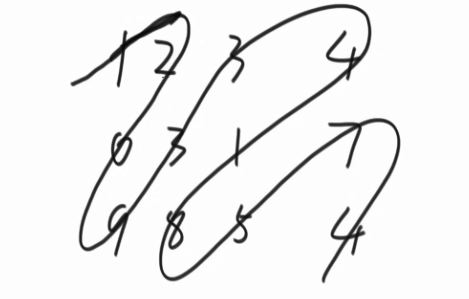

## 第三章

### **转圈输出n*n的矩阵、进而输出 M * N 的矩阵**

12

34     输出为    1243

对于任意一个矩阵，可以找到他的位于正对角线两边界的元素，

1234 

5678

4329        对于这个矩阵    第一个边界元素是1  ，第二个边界元素是9。

假设 1 的坐标为 （row1，cow1）

假设 9 的坐标为 （row2，cow2）

对于任意一个矩阵，都可以

 从  cow1++到  cow2   其中row不变  输出每个元素         第一行

然后  row1 ++ 到 row2   其中cow不变 输出每个元素         最后一列

然后 cow2-- 到cow1   其中row不变 输出每个元素          最后一行

row2-- 到row1  其中cow不变  输出每个元素。       第一列

当完成一次循环时，（row1++，colw1++）  如果此时没有出现   row1>=row2   则继续上面的函数输出。

代码：

```java
public static void spiralOrderPrint1(int[][] matrix) {
	int row1 = 0;
	int  cow1= 0;
	int row2 = matrix.length - 1;
	int  cow2= matrix[0].length - 1;
	while (cow1 <= cow2 && row1 <= row2) {
		printEdge1(matrix, row1++, cow1++, row2--, cow2--);
	}
}
public static void printEdge1(int[][] m, int row1, int cow1, int row2, int cow2) 
{
	if(row1==row2)
	{
		for (int i = row1; i <= row2; i++) 
		{
			
			System.out.print(m[row1][i] + " ");
		}
	}
	else if (cow1==cow2)
	{
		for (int i = cow1; i <= cow1; i++) 
		{
			
			System.out.print(m[i][cow1] + " ");
		}
	}
	else
	{
		
		int c=cow1;
		int r=row1;
		while(c!=cow2)
		{
			System.out.println(m[row1][c]+" ");
			c++;
		}
		while(r!=row2)
		{
			System.out.println(m[r][cow2]+" ");
			r++;
		}
		while(c!=cow1)
		{
			System.out.println(m[row2][c]+" ");
			c--;
		}
		while(r!=row1)
		{
			System.out.println(m[r][cow1]+" ");
			r--;
		}
	}
	
}
```
### 矩阵按之字打印输出




```java
    public static void printMatrixZigZag(int[][] matrix) {
        int row1 = 0;
        int cow1 = 0;
        int row2 = 0;
        int cow2 = 0;
        int endR = matrix.length - 1;
        //最后一行
        int endC = matrix[0].length - 1;
        //最后一列
        boolean fromUp = false;
        while (row1 != endR + 1) {
            printLevel(matrix, row1, cow1, row2, cow2, fromUp);
            row1 = cow1 == endC ? row1 + 1 : row1;
            //当 c1 到达最后一列时   r1 增加  否则不变
            cow1 = cow1 == endC ? cow1 : cow1 + 1;
            // 当 c1 到达最后一列时    c1++   否则不变
            cow2 = row2 == endR ? cow2 + 1 : cow2;
            // 当 row2 到达最后一行时   c2不变   否则 c2++
            row2 = row2 == endR ? row2 : row2 + 1;
            // 当 row2 到达最后一行时  row++  否则不变
            fromUp = !fromUp;
        }
        System.out.println();
    }

    public static void printLevel(int[][] m, int row1, int cow1, int row2, int cow2,
                                  boolean f) {
        if (f) {
            while (row1 <= row2 ) {
                System.out.print(m[row1++][cow1--] + " ");
                //上往下打印
            }
        } else {
            while (row2 != row1 - 1) {
                System.out.print(m[row2--][cow2++] + " ");
                //下往上打印
            }
        }
    }

    public static void main(String[] args) {
        int[][] matrix = { { 1, 2, 3, 4 }, { 5, 6, 7, 8 }, { 9, 10, 11, 12 } };
        printMatrixZigZag(matrix);

    }
```


### 在行列都排序好的矩阵中找数


因为整个矩阵是每行每列都是排序好的。

从右上角的数（记做a）开始判断，

如果  a>7, a的列坐标-1， 判断 a与7的关系

如果 a<7,a 的行坐标+1， 判断  a与 7 的关系

对于任意一个K ，每次判断，a的只能往前或者往下，只有这两种可能

因为 这个点想左移动 最多m ，向下移动最多n ，所以时间复杂度是 O（M+N）

```java
	public static boolean isContains(int[][] matrix, int K) {
		int row = 0;
		int col = matrix[0].length - 1;
		while (row < matrix.length && col > -1) {
			if (matrix[row][col] == K) {
				return true;
			} else if (matrix[row][col] > K) {
				col--;
			} else {
				row++;
			}
		}
		return false;
	}

	public static void main(String[] args) {
		int[][] matrix = new int[][] { { 0, 1, 2, 3, 4, 5, 6 },// 0
				{ 10, 12, 13, 15, 16, 17, 18 },// 1
				{ 23, 24, 25, 26, 27, 28, 29 },// 2
				{ 44, 45, 46, 47, 48, 49, 50 },// 3
				{ 65, 66, 67, 68, 69, 70, 71 },// 4
				{ 96, 97, 98, 99, 100, 111, 122 },// 5
				{ 166, 176, 186, 187, 190, 195, 200 },// 6
				{ 233, 243, 321, 341, 356, 370, 380 } // 7
		};
		int K = 233;
		System.out.println(isContains(matrix, K));
	}

```

 