## 第三章

### **转圈输出n*n的矩阵、进而输出 M * N 的矩阵**

12

34     输出为    1243

对于任意一个矩阵，可以找到他的位于正对角线两边界的元素，

1234 

5678

4329        对于这个矩阵    第一个边界元素是1  ，第二个边界元素是9。

假设 1 的坐标为 （row1，cow1）

假设 9 的坐标为 （row2，cow2）

对于任意一个矩阵，都可以

 从  cow1++到  cow2   其中row不变  输出每个元素         第一行

然后  row1 ++ 到 row2   其中cow不变 输出每个元素         最后一列

然后 cow2-- 到cow1   其中row不变 输出每个元素          最后一行

row2-- 到row1  其中cow不变  输出每个元素。       第一列

当完成一次循环时，（row1++，colw1++）  如果此时没有出现   row1>=row2   则继续上面的函数输出。

代码：

```java
public static void spiralOrderPrint1(int[][] matrix) {
	int row1 = 0;
	int  cow1= 0;
	int row2 = matrix.length - 1;
	int  cow2= matrix[0].length - 1;
	while (cow1 <= cow2 && row1 <= row2) {
		printEdge1(matrix, row1++, cow1++, row2--, cow2--);
	}
}
public static void printEdge1(int[][] m, int row1, int cow1, int row2, int cow2) 
{
	if(row1==row2)
	{
		for (int i = row1; i <= row2; i++) 
		{
			
			System.out.print(m[row1][i] + " ");
		}
	}
	else if (cow1==cow2)
	{
		for (int i = cow1; i <= cow1; i++) 
		{
			
			System.out.print(m[i][cow1] + " ");
		}
	}
	else
	{
		
		int c=cow1;
		int r=row1;
		while(c!=cow2)
		{
			System.out.println(m[row1][c]+" ");
			c++;
		}
		while(r!=row2)
		{
			System.out.println(m[r][cow2]+" ");
			r++;
		}
		while(c!=cow1)
		{
			System.out.println(m[row2][c]+" ");
			c--;
		}
		while(r!=row1)
		{
			System.out.println(m[r][cow1]+" ");
			r--;
		}
	}
	
}
```
### 矩阵按之字打印输出


```java
    public static void printMatrixZigZag(int[][] matrix) {
        int row1 = 0;
        int cow1 = 0;
        int row2 = 0;
        int cow2 = 0;
        int endR = matrix.length - 1;
        //最后一行
        int endC = matrix[0].length - 1;
        //最后一列
        boolean fromUp = false;
        while (row1 != endR + 1) {
            printLevel(matrix, row1, cow1, row2, cow2, fromUp);
            row1 = cow1 == endC ? row1 + 1 : row1;
            //当 c1 到达最后一列时   r1 增加  否则不变
            cow1 = cow1 == endC ? cow1 : cow1 + 1;
            // 当 c1 到达最后一列时    c1++   否则不变
            cow2 = row2 == endR ? cow2 + 1 : cow2;
            // 当 row2 到达最后一行时   c2不变   否则 c2++
            row2 = row2 == endR ? row2 : row2 + 1;
            // 当 row2 到达最后一行时  row++  否则不变
            fromUp = !fromUp;
        }
        System.out.println();
    }

    public static void printLevel(int[][] m, int row1, int cow1, int row2, int cow2,
                                  boolean f) {
        if (f) {
            while (row1 <= row2 ) {
                System.out.print(m[row1++][cow1--] + " ");
                //上往下打印
            }
        } else {
            while (row2 != row1 - 1) {
                System.out.print(m[row2--][cow2++] + " ");
                //下往上打印
            }
        }
    }

    public static void main(String[] args) {
        int[][] matrix = { { 1, 2, 3, 4 }, { 5, 6, 7, 8 }, { 9, 10, 11, 12 } };
        printMatrixZigZag(matrix);

    }
```


### 在行列都排序好的矩阵中找数


因为整个矩阵是每行每列都是排序好的。

从右上角的数（记做a）开始判断，

如果  a>7, a的列坐标-1， 判断 a与7的关系

如果 a<7,a 的行坐标+1， 判断  a与 7 的关系

对于任意一个K ，每次判断，a的只能往前或者往下，只有这两种可能

因为 这个点想左移动 最多m ，向下移动最多n ，所以时间复杂度是 O（M+N）

```java
        public static boolean isContains(int[][] matrix, int K) {
            int row = 0;
            int col = matrix[0].length - 1;
            while (row < matrix.length && col > -1) {
                if (matrix[row][col] == K) {
                    return true;
                } else if (matrix[row][col] > K) {
                    col--;
                } else {
                    row++;
                }
            }
            return false;
        }

        public static void main(String[] args) {
            int[][] matrix = new int[][] { { 0, 1, 2, 3, 4, 5, 6 },// 0
                    { 10, 12, 13, 15, 16, 17, 18 },// 1
                    { 23, 24, 25, 26, 27, 28, 29 },// 2
                    { 44, 45, 46, 47, 48, 49, 50 },// 3
                    { 65, 66, 67, 68, 69, 70, 71 },// 4
                    { 96, 97, 98, 99, 100, 111, 122 },// 5
                    { 166, 176, 186, 187, 190, 195, 200 },// 6
                    { 233, 243, 321, 341, 356, 370, 380 } // 7
            };
            int K = 233;
            System.out.println(isContains(matrix, K));
        }

```


### 打印两个有序链表的公共部分

 

使用一个指针指向head1 ，另一个指针指向head2.

如果当前两个指针指向的节点的值一致，输出，两个指针均向后移动一个，

如果head1 的值 >head2 的值，head2 向后移动一个单位，继续判断。

如果head1 的值 < head2的值，head1 向后移动一个单位，继续判断。

当这两个指针中有一个或一个以上的指针指向为空时，结束循环

因为只是遍历加输出  最多2n  所以时间复杂度为 O(n)

```java
public static class Node {
	public int value;
	public Node next;
	public Node(int data) {
		this.value = data;
	}
}

public static void printCommonPart(Node head1, Node head2) {
	System.out.print("Common Part: ");
	while (head1 != null && head2 != null) {
		if (head1.value < head2.value) {
			head1 = head1.next;
		} else if (head1.value > head2.value) {
			head2 = head2.next;
		} else {
			System.out.print(head1.value + " ");
			head1 = head1.next;
			head2 = head2.next;
		}
	}
	System.out.println();
}

public static void printLinkedList(Node node) {
	System.out.print("Linked List: ");
	while (node != null) {
		System.out.print(node.value + " ");
		node = node.next;
	}
	System.out.println();
}

public static void main(String[] args) {
	Node node1 = new Node(2);
	node1.next = new Node(3);
	node1.next.next = new Node(5);
	node1.next.next.next = new Node(6);

	Node node2 = new Node(1);
	node2.next = new Node(2);
	node2.next.next = new Node(5);
	node2.next.next.next = new Node(7);
	node2.next.next.next.next = new Node(8);

	printLinkedList(node1);
	printLinkedList(node2);
	printCommonPart(node1, node2);

}
```


### 判断一个链表是否为回文结构

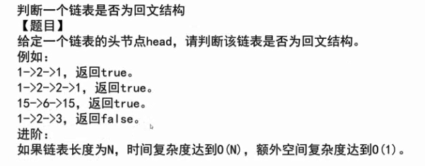

回文，就是有个对称轴，123 321 ，1221，121.这种的数的结构就是回文结构。

有个比较巧妙的办法，准备一个栈，将链表中的每个节点的值依次压入栈中，然后让栈中的数依次出栈，让每个出栈的数去比较链表中的数，如果之后最后一个数都相等，那就是回文，如果有一个数不符，那就不是。

123454321    进栈之后就是       123454321 （栈顶）。每次出栈一个数都与原来的数一样。

额外空间复杂度是 O（n）

**进阶方法1**           

准备两个指针，一个一次走一步，另一个一次走两步。当快的指针走完时，慢指针走到这个链表的中点位置，将慢指针的右边的数，压入栈中，然后依次与链表中的数进行比较。

比如 1234321    压入栈中        的数就是   321（栈顶），比较之后全部相符，是回文结构。

省了一半的空间，但还是O（n）

**进阶方法2**

不使用额外空间。

准备两个指针，一个一次走一步，另一个一次走两步。当快的指针走完时，慢指针走到这个链表的中点位置，将慢指针的右边的节点逆序指向，然后依次从最后一个节点开始和第一个节点判断。如果想等，继续，直到其中一个节点指向null停止，如果不等，那就不是回文结构。在返回结果前，需要将逆序之后的链表再进行逆序，不能改变原来链表的结构。

比如   1->2->3->2->1     修改之后   1-> 2->  3   <-2  <-1     3->null

要考虑好如何逆序、当这个链表的节点数量是偶数是怎么办、奇数时怎么办。

```java
  public static class Node {
        public int value;
        public Node next;

        public Node(int data) {
            this.value = data;
        }
    }

    // need n extra space
    public static boolean isPalindrome1(Node head) {
        Stack<Node> stack = new Stack<Node>();
        Node cur = head;
        while (cur != null) {
            stack.push(cur);
            cur = cur.next;
        }
        while (head != null) {
            if (head.value != stack.pop().value) {
                return false;
            }
            head = head.next;
        }
        return true;
    }

    // need n/2 extra space
    public static boolean isPalindrome2(Node head) {
        if (head == null || head.next == null) {
            return true;
        }
        Node right = head.next;
        Node cur = head;
        while (cur.next != null && cur.next.next != null) {
            right = right.next;
            cur = cur.next.next;
        }
        Stack<Node> stack = new Stack<Node>();
        while (right != null) {
            stack.push(right);
            right = right.next;
        }
        while (!stack.isEmpty()) {
            if (head.value != stack.pop().value) {
                return false;
            }
            head = head.next;
        }
        return true;
    }

    // need O(1) extra space
    public static boolean isPalindrome3(Node head) {
        if (head == null || head.next == null) {
            return true;
        }
        Node n1 = head;
        Node n2 = head;
        while (n2.next != null && n2.next.next != null) { // find mid node
            n1 = n1.next; // n1 -> mid
            n2 = n2.next.next; // n2 -> end
        }
        n2 = n1.next; // n2 -> right part first node
        n1.next = null; // mid.next -> null
        Node n3 = null;
        while (n2 != null) { // right part convert
            n3 = n2.next; // n3 -> save next node
            n2.next = n1; // next of right node convert
            n1 = n2; // n1 move
            n2 = n3; // n2 move
        }
        n3 = n1;
        // n3 -> save last node
        //退出上一个循环时，n3为，而n1 为最后一个节点

        n2 = head;
        // n2 -> left first node
        // 将左边第一个结点 赋值给 n2
        boolean res = true;
        while (n1 != null && n2 != null) { // check palindrome
            if (n1.value != n2.value) {
                res = false;
                break;
            }
            n1 = n1.next; // left to mid
            n2 = n2.next; // right to mid
        }
        // 下面又将已经更改过的链表返回原样
        n1 = n3.next;
        n3.next = null;
        while (n1 != null) { // recover list
            n2 = n1.next;
            n1.next = n3;
            n3 = n1;
            n1 = n2;
        }
        return res;
    }

    public static void printLinkedList(Node node) {
        System.out.print("Linked List: ");
        while (node != null) {
            System.out.print(node.value + " ");
            node = node.next;
        }
        System.out.println();
    }

    public static void main(String[] args) {

        Node head = null;
        printLinkedList(head);
        System.out.print(isPalindrome1(head) + " | ");
        System.out.print(isPalindrome2(head) + " | ");
        System.out.println(isPalindrome3(head) + " | ");
        printLinkedList(head);
        System.out.println("=========================");

        head = new Node(1);
        printLinkedList(head);
        System.out.print(isPalindrome1(head) + " | ");
        System.out.print(isPalindrome2(head) + " | ");
        System.out.println(isPalindrome3(head) + " | ");
        printLinkedList(head);
        System.out.println("=========================");

        head = new Node(1);
        head.next = new Node(2);
        printLinkedList(head);
        System.out.print(isPalindrome1(head) + " | ");
        System.out.print(isPalindrome2(head) + " | ");
        System.out.println(isPalindrome3(head) + " | ");
        printLinkedList(head);
        System.out.println("=========================");

        head = new Node(1);
        head.next = new Node(1);
        printLinkedList(head);
        System.out.print(isPalindrome1(head) + " | ");
        System.out.print(isPalindrome2(head) + " | ");
        System.out.println(isPalindrome3(head) + " | ");
        printLinkedList(head);
        System.out.println("=========================");

        head = new Node(1);
        head.next = new Node(2);
        head.next.next = new Node(3);
        printLinkedList(head);
        System.out.print(isPalindrome1(head) + " | ");
        System.out.print(isPalindrome2(head) + " | ");
        System.out.println(isPalindrome3(head) + " | ");
        printLinkedList(head);
        System.out.println("=========================");

        head = new Node(1);
        head.next = new Node(2);
        head.next.next = new Node(1);
        printLinkedList(head);
        System.out.print(isPalindrome1(head) + " | ");
        System.out.print(isPalindrome2(head) + " | ");
        System.out.println(isPalindrome3(head) + " | ");
        printLinkedList(head);
        System.out.println("=========================");

        head = new Node(1);
        head.next = new Node(2);
        head.next.next = new Node(3);
        head.next.next.next = new Node(1);
        printLinkedList(head);
        System.out.print(isPalindrome1(head) + " | ");
        System.out.print(isPalindrome2(head) + " | ");
        System.out.println(isPalindrome3(head) + " | ");
        printLinkedList(head);
        System.out.println("=========================");

        head = new Node(1);
        head.next = new Node(2);
        head.next.next = new Node(2);
        head.next.next.next = new Node(1);
        printLinkedList(head);
        System.out.print(isPalindrome1(head) + " | ");
        System.out.print(isPalindrome2(head) + " | ");
        System.out.println(isPalindrome3(head) + " | ");
        printLinkedList(head);
        System.out.println("=========================");

        head = new Node(1);
        head.next = new Node(2);
        head.next.next = new Node(3);
        head.next.next.next = new Node(2);
        head.next.next.next.next = new Node(1);
        printLinkedList(head);
        System.out.print(isPalindrome1(head) + " | ");
        System.out.print(isPalindrome2(head) + " | ");
        System.out.println(isPalindrome3(head) + " | ");
        printLinkedList(head);
        System.out.println("=========================");

    }


```

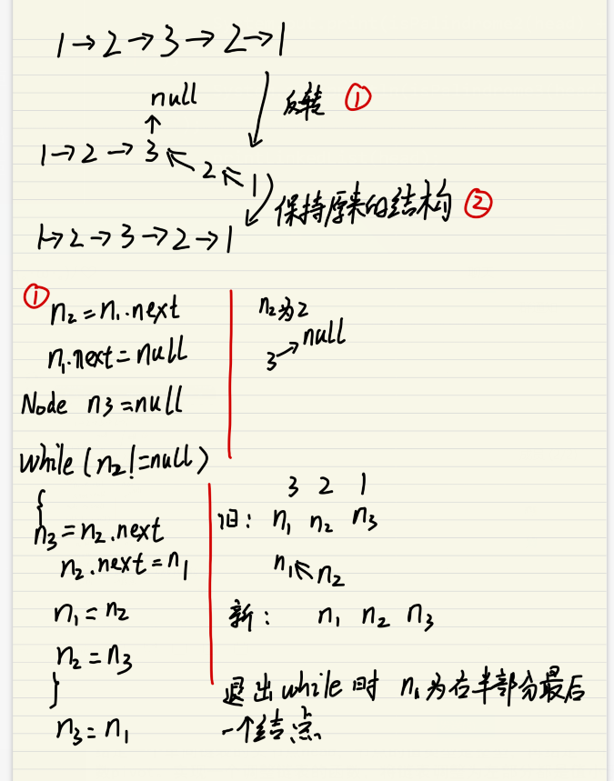

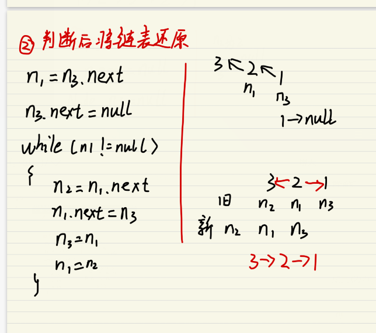


### 将单向链表按某值划发成左边小、中间相等、右边大的形式

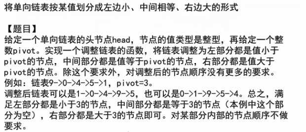

方法1

准备一个数组，将链表的节点的数值遍历到数组里，然后数组排序，再讲排序后的数据遍历赋值给链表中的节点。时间、空间复杂度均为O（n）。

方法2

准备三个链表，第一遍遍历题目中所给的链表，将链表第一个中小于所给数放入第一个链表，第一个等于所给数放入第二个链表，第三个所给数放入第三个链表，并分别记下他们的内存地址。

再遍历一遍题目中所给链表，将小于所给数的数字放入第一个链表，注意判断是否和第一个数的内存地址是否相等，如果相等则遍历题目中所给链表的下一个数。等于所给数的放到第二个链表里、大于的当第三个里。

遍历完成之后依次连接第一个、第二个、第三个链表 。

```java
public static class Node {
    public int value;
    public Node next;

    public Node(int data) {
        this.value = data;
    }
}

public static Node listPartition1(Node head, int pivot) {
    if (head == null) {
        return head;
    }
    Node cur = head;
    int i = 0;
    while (cur != null) {
        i++;
        cur = cur.next;
    }
    Node[] nodeArr = new Node[i];
    i = 0;
    cur = head;
    for (i = 0; i != nodeArr.length; i++) {
        nodeArr[i] = cur;
        cur = cur.next;
    }
    arrPartition(nodeArr, pivot);
    for (i = 1; i != nodeArr.length; i++) {
        nodeArr[i - 1].next = nodeArr[i];
    }
    nodeArr[i - 1].next = null;
    return nodeArr[0];
}

public static void arrPartition(Node[] nodeArr, int pivot) {
    int small = -1;
    int big = nodeArr.length;
    int index = 0;
    while (index != big) {
        if (nodeArr[index].value < pivot) {
            swap(nodeArr, ++small, index++);
        } else if (nodeArr[index].value == pivot) {
            index++;
        } else {
            swap(nodeArr, --big, index);
        }
    }
}

public static void swap(Node[] nodeArr, int a, int b) {
    Node tmp = nodeArr[a];
    nodeArr[a] = nodeArr[b];
    nodeArr[b] = tmp;
}

public static Node listPartition2(Node head, int pivot) {
    Node sH = null; // small head
    Node sT = null; // small tail
    Node eH = null; // equal head
    Node eT = null; // equal tail
    Node bH = null; // big head
    Node bT = null; // big tail
    Node next = null; // save next node
    // every node distributed to three lists
    while (head != null) {
        next = head.next;
        head.next = null;
        if (head.value < pivot) {
            if (sH == null) {
                sH = head;
                sT = head;
            } else {
                sT.next = head;
                sT = head;
            }
        } else if (head.value == pivot) {
            if (eH == null) {
                eH = head;
                eT = head;
            } else {
                eT.next = head;
                eT = head;
            }
        } else {
            if (bH == null) {
                bH = head;
                bT = head;
            } else {
                bT.next = head;
                bT = head;
            }
        }
        head = next;
    }
    // small and equal reconnect
    if (sT != null) {
        sT.next = eH;
        eT = eT == null ? sT : eT;
    }
    // all reconnect
    if (eT != null) {
        eT.next = bH;
    }
    return sH != null ? sH : eH != null ? eH : bH;
}

public static void printLinkedList(Node node) {
    System.out.print("Linked List: ");
    while (node != null) {
        System.out.print(node.value + " ");
        node = node.next;
    }
    System.out.println();
}

public static void main(String[] args) {
    Node head1 = new Node(7);
    head1.next = new Node(9);
    head1.next.next = new Node(1);
    head1.next.next.next = new Node(8);
    head1.next.next.next.next = new Node(5);
    head1.next.next.next.next.next = new Node(2);
    head1.next.next.next.next.next.next = new Node(5);
    printLinkedList(head1);
    // head1 = listPartition1(head1, 4);
    head1 = listPartition2(head1, 5);
    printLinkedList(head1);

}
```


### 复制含有随机指针节点的链表

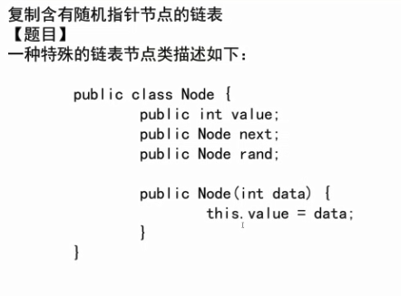

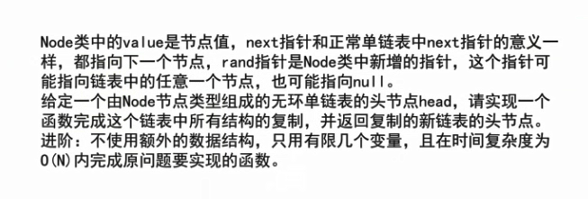

方法1

使用一个哈希表，遍历链表，将链表中的每个节点当做key，新建一个节点当做value，并且将key的指针和随机指针赋值给value中的节点，当链表中全部遍历完之后，返回value的头节点，那就是拷贝链表的头结点。

方法2  进阶  只是用有限几个变量

将每个节点对应的拷贝节点，都放到旧节点之后

1-1'-2-2'-3-3'

假设原链表中的1的rand 指针指向3,2的rand指向1,3的rand指向null

然后将1  的 rand指针指向的节点   复制给 1'  ，其他几个节点也执行相同操作。

最后会得到每个节点都含有原来链表中的rand 指针的大链表，将这个大链表进行拆分，将拷贝的节点进行分离。


```java
public static class Node {
		public int value;
		public Node next;
		public Node rand;
    public Node(int data) {
		this.value = data;
	}
}

public static Node copyListWithRand1(Node head) {
	HashMap<Node, Node> map = new HashMap<Node, Node>();
	Node cur = head;
	while (cur != null) {
		map.put(cur, new Node(cur.value));
		cur = cur.next;
	}
	cur = head;
	while (cur != null) {
		map.get(cur).next = map.get(cur.next);
		map.get(cur).rand = map.get(cur.rand);
		cur = cur.next;
	}
	return map.get(head);
}

public static Node copyListWithRand2(Node head) {
	if (head == null) {
		return null;
	}
	Node cur = head;
	Node next = null;
	// copy node and link to every node
	while (cur != null) {
		next = cur.next;
		cur.next = new Node(cur.value);
		cur.next.next = next;
		cur = next;
	}
	cur = head;
	Node curCopy = null;
	// set copy node rand
	while (cur != null) {
		next = cur.next.next;
		curCopy = cur.next;
		curCopy.rand = cur.rand != null ? cur.rand.next : null;
		cur = next;
	}
	Node res = head.next;
	cur = head;
	// split
	while (cur != null) {
		next = cur.next.next;
		curCopy = cur.next;
		cur.next = next;
		curCopy.next = next != null ? next.next : null;
		cur = next;
	}
	return res;
}

public static void printRandLinkedList(Node head) {
	Node cur = head;
	System.out.print("order: ");
	while (cur != null) {
		System.out.print(cur.value + " ");
		cur = cur.next;
	}
	System.out.println();
	cur = head;
	System.out.print("rand:  ");
	while (cur != null) {
		System.out.print(cur.rand == null ? "- " : cur.rand.value + " ");
		cur = cur.next;
	}
	System.out.println();
}

public static void main(String[] args) {
	Node head = null;
	Node res1 = null;
	Node res2 = null;
	printRandLinkedList(head);
	res1 = copyListWithRand1(head);
	printRandLinkedList(res1);
	res2 = copyListWithRand2(head);
	printRandLinkedList(res2);
	printRandLinkedList(head);
	System.out.println("=========================");

	head = new Node(1);
	head.next = new Node(2);
	head.next.next = new Node(3);
	head.next.next.next = new Node(4);
	head.next.next.next.next = new Node(5);
	head.next.next.next.next.next = new Node(6);

	head.rand = head.next.next.next.next.next; // 1 -> 6
	head.next.rand = head.next.next.next.next.next; // 2 -> 6
	head.next.next.rand = head.next.next.next.next; // 3 -> 5
	head.next.next.next.rand = head.next.next; // 4 -> 3
	head.next.next.next.next.rand = null; // 5 -> null
	head.next.next.next.next.next.rand = head.next.next.next; // 6 -> 4

	printRandLinkedList(head);
	res1 = copyListWithRand1(head);
	printRandLinkedList(res1);
	res2 = copyListWithRand2(head);
	printRandLinkedList(res2);
	printRandLinkedList(head);
	System.out.println("=========================");

}
```


### 两链表相交的一系列问题

### 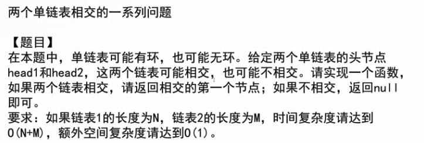

**判断一个链表是否有环**

1、新建一个hash表，将每个节点装入hash表中，如果有一个节点的内存地址已经在hash表中，那这个节点就是环的入口，然后一直往下遍历。如果直到链表为空都没有提前return，这个链表就是无环的。

2、快慢指针，当快指针在走的过程中指向null，那么链表一定无环

 当快慢指针指向的内存地址第一次相等时，将快指针指向开头，此时，快慢指针都一次走一步，当他俩指向的内存地址第二次相等时，这个节点就是环的入口。

**判断两个链表是否相交**

由上面的判断可以知道一个链表是否有环，

**如果两个链表都没环**

1、使用hash表，先将第一个链表的节点全部装入表中，然后依次遍历第二个链表的节点，如果某个节点的内存地址与第一个链表中的对应节点的内存地址相等，那这个节点就是相交节点。

2、遍历两个链表，分别得到两个链表的长度和最后一个节点

如果两个链表的最后一个节点不相同，那么他们不可能相交。返回false

如果 两个链表的最后一个节点的内存地址相同，那么用长链表的长度减去短链表的长度，让一个指针指向长链表，然后每次走一步，走的步数等于刚才得到的相减之后的长度。

然后让两个链表同时开始往下走，当两个指针指向的内存地址第一次相等时，这个节点就是相交节点。

**如果两个链表都有环**

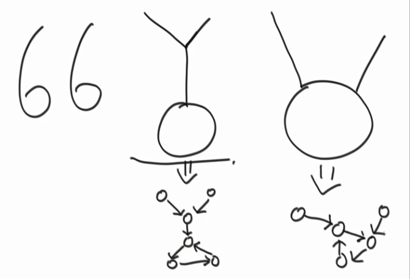

有这三种结构

如果两个链表有相交节点相同

忽略相交之后的节点，然后再复用上面求两个链表的相交节点的函数，即可求出相交节点的位置。

如果相交节点不同

**判断是上图中的第一种还是第三种结构**

将第一个链表中的相交节点继续往下移动，当他的内存地址等于第二个链表的环入口节点地址时，就是第三种结构，返回此时的结点，即为题目所要求的结点位置。如果没有遇到，则第一种结构。而第一种结构没有相交的结点，返回false。

**一个有环一个无环**

他俩不可能相交 

  public static class Node {
		public int value;
		public Node next;

```java
	public Node(int data) {
		this.value = data;
	}
}

public static Node getIntersectNode(Node head1, Node head2) {
	if (head1 == null || head2 == null) {
		return null;
	}
	Node loop1 = getLoopNode(head1);
	Node loop2 = getLoopNode(head2);
	if (loop1 == null && loop2 == null) {
		return noLoop(head1, head2);
	}
	if (loop1 != null && loop2 != null) {
		return bothLoop(head1, loop1, head2, loop2);
	}
	return null;
}

public static Node getLoopNode(Node head) {
	if (head == null || head.next == null || head.next.next == null) {
		return null;
	}
	Node n1 = head.next; // n1 -> slow
	Node n2 = head.next.next; // n2 -> fast
	while (n1 != n2) {
		if (n2.next == null || n2.next.next == null) {
			return null;
		}
		n2 = n2.next.next;
		n1 = n1.next;
	}
	n2 = head; // n2 -> walk again from head
	while (n1 != n2) {
		n1 = n1.next;
		n2 = n2.next;
	}
	return n1;
}

public static Node noLoop(Node head1, Node head2) {
	if (head1 == null || head2 == null) {
		return null;
	}
	Node cur1 = head1;
	Node cur2 = head2;
	int n = 0;
	while (cur1.next != null) {
		n++;
		cur1 = cur1.next;
	}
	while (cur2.next != null) {
		n--;
		cur2 = cur2.next;
	}
	if (cur1 != cur2) {
		return null;
	}
	cur1 = n > 0 ? head1 : head2;
	cur2 = cur1 == head1 ? head2 : head1;
	n = Math.abs(n);
	while (n != 0) {
		n--;
		cur1 = cur1.next;
	}
	while (cur1 != cur2) {
		cur1 = cur1.next;
		cur2 = cur2.next;
	}
	return cur1;
}

public static Node bothLoop(Node head1, Node loop1, Node head2, Node loop2) {
	Node cur1 = null;
	Node cur2 = null;
	if (loop1 == loop2) {
		cur1 = head1;
		cur2 = head2;
		int n = 0;
		while (cur1 != loop1) {
			n++;
			cur1 = cur1.next;
		}
		while (cur2 != loop2) {
			n--;
			cur2 = cur2.next;
		}
		cur1 = n > 0 ? head1 : head2;
		cur2 = cur1 == head1 ? head2 : head1;
		n = Math.abs(n);
		while (n != 0) {
			n--;
			cur1 = cur1.next;
		}
		while (cur1 != cur2) {
			cur1 = cur1.next;
			cur2 = cur2.next;
		}
		return cur1;
	} else {
		cur1 = loop1.next;
		while (cur1 != loop1) {
			if (cur1 == loop2) {
				return loop1;
			}
			cur1 = cur1.next;
		}
		return null;
	}
}

public static void main(String[] args) {
	// 1->2->3->4->5->6->7->null
	Node head1 = new Node(1);
	head1.next = new Node(2);
	head1.next.next = new Node(3);
	head1.next.next.next = new Node(4);
	head1.next.next.next.next = new Node(5);
	head1.next.next.next.next.next = new Node(6);
	head1.next.next.next.next.next.next = new Node(7);

	// 0->9->8->6->7->null
	Node head2 = new Node(0);
	head2.next = new Node(9);
	head2.next.next = new Node(8);
	head2.next.next.next = head1.next.next.next.next.next; // 8->6
	System.out.println(getIntersectNode(head1, head2).value);

	// 1->2->3->4->5->6->7->4...
	head1 = new Node(1);
	head1.next = new Node(2);
	head1.next.next = new Node(3);
	head1.next.next.next = new Node(4);
	head1.next.next.next.next = new Node(5);
	head1.next.next.next.next.next = new Node(6);
	head1.next.next.next.next.next.next = new Node(7);
	head1.next.next.next.next.next.next = head1.next.next.next; // 7->4

	// 0->9->8->2...
	head2 = new Node(0);
	head2.next = new Node(9);
	head2.next.next = new Node(8);
	head2.next.next.next = head1.next; // 8->2
	System.out.println(getIntersectNode(head1, head2).value);

	// 0->9->8->6->4->5->6..
	head2 = new Node(0);
	head2.next = new Node(9);
	head2.next.next = new Node(8);
	head2.next.next.next = head1.next.next.next.next.next; // 8->6
	System.out.println(getIntersectNode(head1, head2).value);

}
```


### 认识布隆过滤器和一致性哈希

#### 布隆过滤器

**百度百科：**

  布隆过滤器（Bloom Filter）是1970年由布隆提出的。它实际上是一个很长的[二进制](https://baike.baidu.com/item/二进制/361457)向量和一系列随机映射函数。布隆过滤器可以用于检索一个元素是否在一个集合中。它的优点是空间效率和查询时间都比一般的算法要好的多，缺点是有一定的误识别率和删除困难。

如果想要判断一个元素是不是在一个集合里，一般想到的是将所有元素保存起来，然后通过比较确定。[链表](https://baike.baidu.com/item/链表/9794473)，树等等数据结构都是这种思路. 但是随着集合中元素的增加，我们需要的存储空间越来越大，检索速度也越来越慢(O(n),O(logn))。不过世界上还有一种叫作散列表（又叫[哈希表](https://baike.baidu.com/item/哈希表/5981869)，Hash table）的数据结构。它可以通过一个[Hash函数](https://baike.baidu.com/item/Hash函数/10555888)将一个元素映射成一个位阵列（Bit array）中的一个点。这样一来，我们只要看看这个点是不是1就可以知道集合中有没有它了。这就是布隆过滤器的基本思想。

[Hash](https://baike.baidu.com/item/Hash/390310)面临的问题就是冲突。假设Hash函数是良好的，如果我们的位阵列长度为m个点，那么如果我们想将冲突率降低到例如  1%, 这个散列表就只能容纳m /  100个元素。显然这就不叫空间效率了（Space-efficient）了。解决方法也简单，就是使用多个Hash，如果它们有一个说元素不在集合中，那肯定就不在。如果它们都说在，虽然也有一定可能性它们在说谎，不过直觉上判断这种事情的[概率](https://baike.baidu.com/item/概率)是比较低的。

**应用**

网页URL的去重，垃圾邮件的判别，集合重复元素的判别，查询加速（比如基于key-value的存储系统）等。

**个人理解**

如果有一亿个64位长度的url需要加入到内存，请使用占用空间最少的办法。

建立一个 m个bit 长的（1byte =8 bits）数组   ，准备k个hash函数，每个url 通过h1、h2。。。hk 个hash函数进行运算，得到的数字%m ，并将bits数组中对应位置进行取反（初始为0，取反为1），下次查询时，再进行同样的操作，如果每个函数的hash值最后的值在数组上的状态都是1，那就说明这个url已经加入到内存中了。

m的取值与需要处理的样本数量、预期失误率有关 

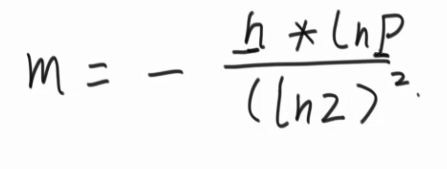


n为样本量、p为失误率（比如万分之一、百万分之一）

哈希函数的个数 k 向上取整：

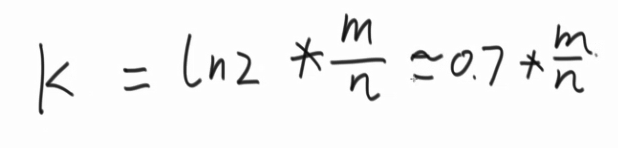

真实失误率估算：

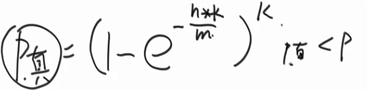

**空间要求非常严重、单样本空间大**  使用布隆过滤器

**面试提示点：**

黑名单问题、要求问题极为苛刻、单样本空间大、允不允许失误率。

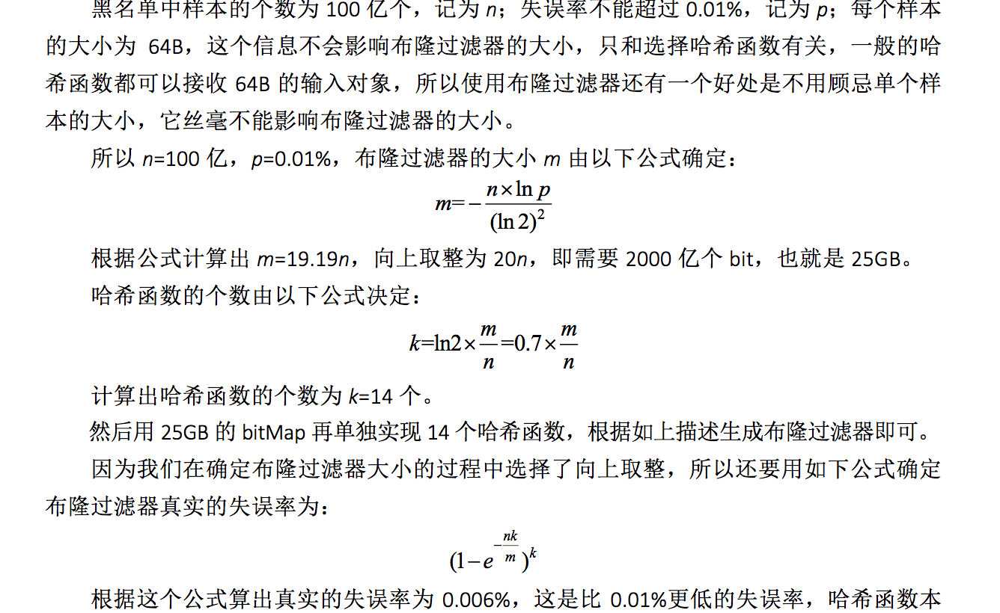


#### 一致性哈希

一个key 进过hash计算 模一个数，可以较为平均的将很多key存放到，对于的数代表的容器中。缺点是当增加一个容器，那么数据迁移的成本太大。

**一致性哈希**

将所有的哈希值连成一个环，将代表容器的编号也进行hash计算，会较为均匀的分布到环上，然后计算每个key ，将key 对应到hash值得环上。存储时，每次都存储到比当前值大的、最近容器中。

比如容器的hash 值    1,100 ，19亿，130亿

现在有个key 的hash值 为20亿那就存储到130亿代表的容器中。

如果现在新加一个容器，比如是 1万，那容器的hash值排序就是 1,100 ，1万，19亿，130亿

然后从原来19亿的容器中，将hash值在100到1万的key，交给1万的那个容器。这样迁移的成本就降低了很多很多。

**解决当容器个数很少时，hash函数的均衡性低的问题。**

假设给每个容器分配1万个虚拟节点，然后让这些虚拟节点去计算得出他在hash值环上的位置，如此一来便使得hash函数的均衡性得以提高。

