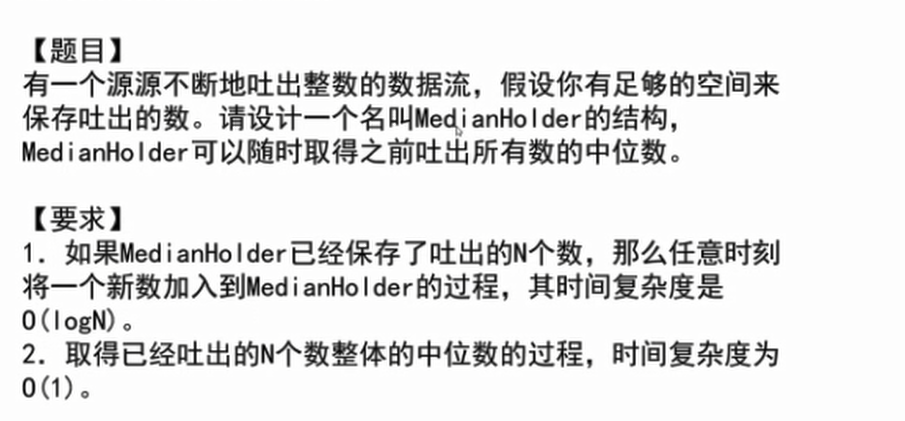
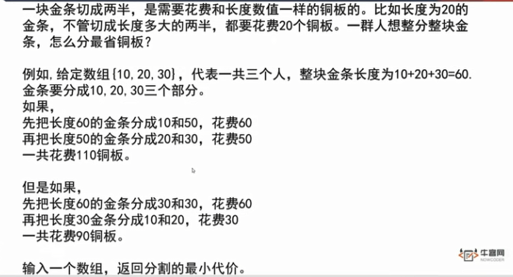
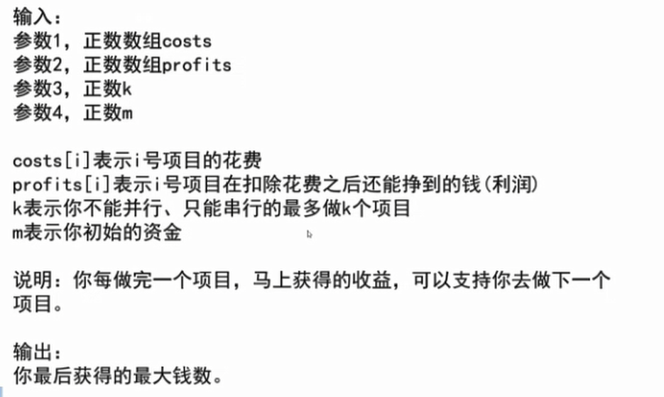

## 第四章

### 随时找到数据流的中位数




### 比较器

当比较的东西为一个对象时，系统不知道你要比较的是什么，会拿对象在内存中的地址去比较，但这并不是咱们的预期结果。所以要使用其他的比较办法，java中有比较器Comparator，实现这个接口就可以进行比较。

```java
public static class Student {
		public String name;
		public int id;
		public int age;

		public Student(String name, int id, int age) {
			this.name = name;
			this.id = id;
			this.age = age;
		}
	}
	public static class IdAscendingComparator implements Comparator<Student> {
		@Override
		public int compare(Student o1, Student o2) {
			return o1.id - o2.id;
            //返回负数    o1 放前面
		}
	}

	public static void printStudents(Student[] students) {
		for (Student student : students) {
			System.out.println("Name : " + student.name + ", Id : " + student.id + ", Age : " + student.age);
		}
		System.out.println("===========================");
	}

	public static void main(String[] args) {
		Student student1 = new Student("A", 1, 23);
		Student student2 = new Student("B", 2, 21);
		Student student3 = new Student("C", 3, 22);

		Student[] students = new Student[] { student3, student2, student1 };
		printStudents(students);

		Arrays.sort(students, new IdAscendingComparator());
        //按照自己定义的比较器策略进下排序
        //利用student 中的id属性 升序进行排序
		printStudents(students);

```

比较器：

返回-1，前一个值放前面

返回1，后一个值放前面

系统中实现堆其实是小根堆，其实是完全二叉树。每次查找值都是O(log N)

PriorityQueue<Student> heap = new PriorityQueue<> ( new StudentComparatoe()  )

按自己定义的比较方法来进行实现系统的堆。


#### 实现思路

准备两个堆，一个放前 n/2 个数，另一个放后 n/2个数。

比如   5 3  6 4

5   放到大根堆里，第二个数进来，5>3   ,将 3放到5下面。此时第一个堆里有2个数，第二个里有0个数。2-0>1 。将第一个堆的堆顶的数放入第二个堆，即小根堆，此时第一个堆里只有3 ，第二个里只有5 。

6 进来， 放入小根堆 

3        5 6

4进来， 4比3 大，进小根堆，但是此时小根堆里有三个数，3-1>1  ,所以将小根堆的堆顶弹出到大根堆。

此时：

3 4     56 

大根堆堆顶为4，小根堆堆顶为5，中位数便可找到。


### 切割问题



  

**哈夫曼编码**

**最小生成树**

比如现在数组里的数为    1，4，6，8，3，9.

先把这个数组中的数组成一个小根堆，

每次将最小的两个数弹出，相加，再放回去。每次累计相加结果

直到这个里只有一个数。

那么累加结果就是要找的最小代价。


### 贪心




