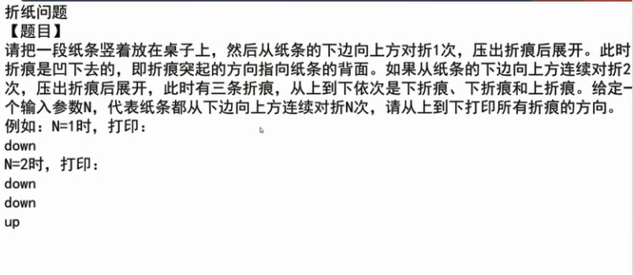
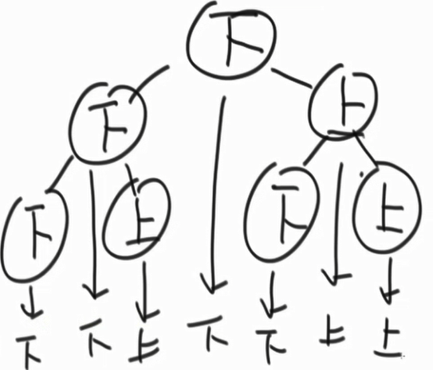
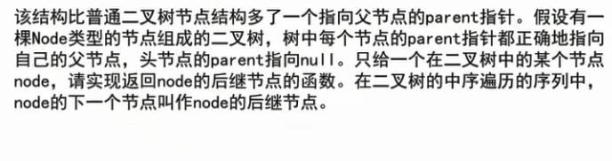
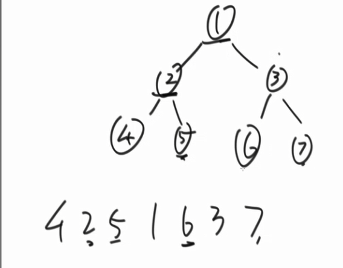
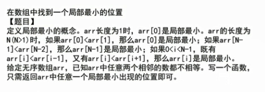

## 第四章

### 随时找到数据流的中位数


### 比较器

当比较的东西为一个对象时，系统不知道你要比较的是什么，会拿对象在内存中的地址去比较，但这并不是咱们的预期结果。所以要使用其他的比较办法，java中有比较器Comparator，实现这个接口就可以进行比较。

```java
public static class Student {
		public String name;
		public int id;
		public int age;

		public Student(String name, int id, int age) {
			this.name = name;
			this.id = id;
			this.age = age;
		}
	}
	public static class IdAscendingComparator implements Comparator<Student> {
		@Override
		public int compare(Student o1, Student o2) {
			return o1.id - o2.id;
            //返回负数    o1 放前面
		}
	}

	public static void printStudents(Student[] students) {
		for (Student student : students) {
			System.out.println("Name : " + student.name + ", Id : " + student.id + ", Age : " + student.age);
		}
		System.out.println("===========================");
	}

	public static void main(String[] args) {
		Student student1 = new Student("A", 1, 23);
		Student student2 = new Student("B", 2, 21);
		Student student3 = new Student("C", 3, 22);

		Student[] students = new Student[] { student3, student2, student1 };
		printStudents(students);

		Arrays.sort(students, new IdAscendingComparator());
        //按照自己定义的比较器策略进下排序
        //利用student 中的id属性 升序进行排序
		printStudents(students);

```

比较器：

返回-1，前一个值放前面

返回1，后一个值放前面

系统中实现堆其实是小根堆，其实是完全二叉树。每次查找值都是O(log N)

PriorityQueue<Student> heap = new PriorityQueue<> ( new StudentComparatoe()  )

按自己定义的比较方法来进行实现系统的堆。


#### 实现思路

准备两个堆，一个放前 n/2 个数，另一个放后 n/2个数。

比如   5 3  6 4

5   放到大根堆里，第二个数进来，5>3   ,将 3放到5下面。此时第一个堆里有2个数，第二个里有0个数。2-0>=2。将第一个堆的堆顶的数放入第二个堆，即小根堆，此时第一个堆里只有3 ，第二个里只有5 。

6 进来， 放入小根堆 

3        5 6

4进来， 4比3 大，进小根堆，但是此时小根堆里有三个数，3-1>=2  ,所以将小根堆的堆顶弹出到大根堆。

此时：

3 4     56 

大根堆堆顶为4，小根堆堆顶为5，中位数便可找到。


```java
	public static class MedianHolder {
		private PriorityQueue<Integer> maxHeap = new PriorityQueue<Integer>(new MaxHeapComparator());
		private PriorityQueue<Integer> minHeap = new PriorityQueue<Integer>(new MinHeapComparator());

		private void modifyTwoHeapsSize() {
            //如果一个堆的size-另一个堆的size >2  弹出栈顶到另一个栈中
			if (this.maxHeap.size() == this.minHeap.size() + 2) {
				this.minHeap.add(this.maxHeap.poll());
			}
			if (this.minHeap.size() == this.maxHeap.size() + 2) {
				this.maxHeap.add(this.minHeap.poll());
			}
		}

		public void addNumber(int num) {
			if (this.maxHeap.isEmpty()) {
                //先加入大根堆 
				this.maxHeap.add(num);
				return;
			}
			if (this.maxHeap.peek() >= num) {
                //如果大根堆的堆顶大于等于此时的num
				this.maxHeap.add(num);
			} else {
				if (this.minHeap.isEmpty()) {
                    //如果小于  将新来的数加到小根堆里
					this.minHeap.add(num);
					return;
				}
				if (this.minHeap.peek() > num) {
					this.maxHeap.add(num);
				} else {
					this.minHeap.add(num);
				}
			}
			modifyTwoHeapsSize();
            //判断此时两个栈是否需要交换
		}

		public Integer getMedian() {
            //得到中位数
			int maxHeapSize = this.maxHeap.size();
			int minHeapSize = this.minHeap.size();
			if (maxHeapSize + minHeapSize == 0) {
				return null;
			}
			Integer maxHeapHead = this.maxHeap.peek();
			Integer minHeapHead = this.minHeap.peek();
			if (((maxHeapSize + minHeapSize) & 1) == 0) {
				return (maxHeapHead + minHeapHead) / 2;
			}
			return maxHeapSize > minHeapSize ? maxHeapHead : minHeapHead;
		}

	}

	public static class MaxHeapComparator implements Comparator<Integer> {
        //定义比较器，比较的是数值，小的在前。
		@Override
		public int compare(Integer o1, Integer o2) {
			if (o2 > o1) {
				return 1;
			} else {
				return -1;
			}
		}
	}

	public static class MinHeapComparator implements Comparator<Integer> {
		@Override
		public int compare(Integer o1, Integer o2) {
			if (o2 < o1) {
				return 1;
			} else {
				return -1;
			}
		}
	}

	// for test
	public static int[] getRandomArray(int maxLen, int maxValue) {
		int[] res = new int[(int) (Math.random() * maxLen) + 1];
		for (int i = 0; i != res.length; i++) {
			res[i] = (int) (Math.random() * maxValue);
		}
		return res;
	}

	// for test, this method is ineffective but absolutely right
	public static int getMedianOfArray(int[] arr) {
		int[] newArr = Arrays.copyOf(arr, arr.length);
		Arrays.sort(newArr);
		int mid = (newArr.length - 1) / 2;
		if ((newArr.length & 1) == 0) {
			return (newArr[mid] + newArr[mid + 1]) / 2;
		} else {
			return newArr[mid];
		}
	}

	public static void printArray(int[] arr) {
		for (int i = 0; i != arr.length; i++) {
			System.out.print(arr[i] + " ");
		}
		System.out.println();
	}

	public static void main(String[] args) {
        int len = 5;
        int maxValue = 10;
        int[] arr = getRandomArray(len, maxValue);
        printArray(arr);
        System.out.println(getMedianOfArray(arr));

            MedianHolder medianHold = new MedianHolder();
            for (int j = 0; j != arr.length; j++) {
                medianHold.addNumber(arr[j]);
            }

        System.out.println(medianHold.getMedian());

	}
```


### 切割问题


  

**哈夫曼编码**

**最小生成树**

比如现在数组里的数为    1，4，6，8，3，9.

先把这个数组中的数组成一个小根堆，

每次将最小的两个数弹出，相加，再放回去。每次累计相加结果

直到这个里只有一个数。

那么累加结果就是要找的最小代价。

```java
public static int lessMoney(int[] arr) {
    PriorityQueue<Integer> pQ = new PriorityQueue<>();
    for (int i = 0; i < arr.length; i++) {
        pQ.add(arr[i]);
    }
    int sum = 0;
    int cur = 0;
    while (pQ.size() > 1) {
        cur = pQ.poll() + pQ.poll();
        sum += cur;
        pQ.add(cur);
    }
    return sum;
}
    public static void main(String[] args) {
        // solution
        int[] arr = { 10, 20, 30};
        System.out.println(lessMoney(arr));
}
```


### 贪心


建立大小根堆

先将所有的花费组成小根堆，用 m 来判断小根堆里的数，比m小的放到大根堆里，此时选择大根堆中收益最大的来做，同时弹出这个元素，代表着这个项目做过了。然后将收益加到m上，用新的m来判断小根堆里的数，重复前面的步骤。直到满足k个项目停止。


### 二叉树的三序遍历的非递归实现

#### 先序    中、左、右

使用一个栈，将第一个节点压入，如果栈顶元素的孩子指针域不为空，弹出第一个节点，遍历第一个节点的左右孩子，如果有右孩子先压入右孩子，再压入左孩子。然后再判断栈顶的元素。先放右再放左。


#### 中序

使用一个栈，将头节点压入栈，然后一直遍历他的左孩子，直到左孩子为空。弹出此时的栈顶元素，将指针指向刚才节点的右孩子，如果右孩子为空，弹出栈顶元素， 将指针指向刚才弹出元素的右孩子，继续这个过程。


#### 后序

先序的顺序是  中  左  右，将 先序改造为  中 右  左。然后将打印出来的数放到另一个栈里，那么真正的输出顺序就是   左 右 中  也就是后序遍历的顺序。

```java
	public static class Node {
		public int value;
		public Node left;
		public Node right;
		public Node(int data) {
			this.value = data;
		}
	}

	public static void preOrderRecur(Node head) {
		if (head == null) {
			return;
		}
		System.out.print(head.value + " ");
		preOrderRecur(head.left);
		preOrderRecur(head.right);
	}

	public static void inOrderRecur(Node head) {
		if (head == null) {
			return;
		}
		inOrderRecur(head.left);
		System.out.print(head.value + " ");
		inOrderRecur(head.right);
	}

	public static void posOrderRecur(Node head) {
		if (head == null) {
			return;
		}
		posOrderRecur(head.left);
		posOrderRecur(head.right);
		System.out.print(head.value + " ");
	}

	public static void preOrderUnRecur(Node head) {
		System.out.print("pre-order: ");
		if (head != null) {
			Stack<Node> stack = new Stack<Node>();
			stack.add(head);
			while (!stack.isEmpty()) {
				head = stack.pop();
				System.out.print(head.value + " ");
				if (head.right != null) {
					stack.push(head.right);
				}
				if (head.left != null) {
					stack.push(head.left);
				}
			}
		}
		System.out.println();
	}

	public static void inOrderUnRecur(Node head) {
		System.out.print("in-order: ");
		if (head != null) {
			Stack<Node> stack = new Stack<Node>();
			while (!stack.isEmpty() || head != null) {
				if (head != null) {
					stack.push(head);
					head = head.left;
				} else {
					head = stack.pop();
					System.out.print(head.value + " ");
					head = head.right;
				}
			}
		}
		System.out.println();
	}

	public static void posOrderUnRecur1(Node head) {
		System.out.print("pos-order: ");
		if (head != null) {
			Stack<Node> s1 = new Stack<Node>();
			Stack<Node> s2 = new Stack<Node>();
			s1.push(head);
			while (!s1.isEmpty()) {
				head = s1.pop();
				s2.push(head);
				if (head.left != null) {
					s1.push(head.left);
				}
				if (head.right != null) {
					s1.push(head.right);
				}
			}
			while (!s2.isEmpty()) {
				System.out.print(s2.pop().value + " ");
			}
		}
		System.out.println();
	}

	public static void posOrderUnRecur2(Node h) {
		System.out.print("pos-order: ");
		if (h != null) {
			Stack<Node> stack = new Stack<Node>();
			stack.push(h);
			Node c = null;
			while (!stack.isEmpty()) {
				c = stack.peek();
				if (c.left != null && h != c.left && h != c.right) {
					stack.push(c.left);
				} else if (c.right != null && h != c.right) {
					stack.push(c.right);
				} else {
					System.out.print(stack.pop().value + " ");
					h = c;
				}
			}
		}
		System.out.println();
	}

	public static void main(String[] args) {
		Node head = new Node(5);
		head.left = new Node(3);
		head.right = new Node(8);
		head.left.left = new Node(2);
		head.left.right = new Node(4);
		head.left.left.left = new Node(1);
		head.right.left = new Node(7);
		head.right.left.left = new Node(6);
		head.right.right = new Node(10);
		head.right.right.left = new Node(9);
		head.right.right.right = new Node(11);

		// recursive
		System.out.println("==============recursive==============");
		System.out.print("pre-order: ");
		preOrderRecur(head);
		System.out.println();
		System.out.print("in-order: ");
		inOrderRecur(head);
		System.out.println();
		System.out.print("pos-order: ");
		posOrderRecur(head);
		System.out.println();

		// unrecursive
		System.out.println("============unrecursive=============");
		preOrderUnRecur(head);
		inOrderUnRecur(head);
		posOrderUnRecur1(head);
		posOrderUnRecur2(head);

	}
```


### 折纸问题

#### 




左子树的节点都为下，右子树的节点都为上的一棵二叉树。

空间复杂度为O（n），即树的高度。

提示的地方在于，折n次，出来2^n  -1 条折痕。

```java
	public static void printAllFolds(int N) {
		printProcess(1, N, true);
	}

	public static void printProcess(int i, int N, boolean down) {
		if (i > N) {
			return;
		}
		printProcess(i + 1, N, true);
		System.out.println(down ? "down " : "up ");
		printProcess(i + 1, N, false);
	}

	public static void main(String[] args) {
		int N = 4;
		printAllFolds(N);

	}
```


### “立体”直观的二叉树

```java
	public static class Node {
		public int value;
		public Node left;
		public Node right;

		public Node(int data) {
			this.value = data;
		}
	}

	public static void printTree(Node head) {
		System.out.println("Binary Tree:");
		printInOrder(head, 0, "H", 17);
		System.out.println();
	}

	public static void printInOrder(Node head, int height, String to, int len) {
		if (head == null) {
			return;
		}
		printInOrder(head.right, height + 1, "v", len);
		String val = to + head.value + to;
		int lenM = val.length();
		int lenL = (len - lenM) / 2;
		int lenR = len - lenM - lenL;
		val = getSpace(lenL) + val + getSpace(lenR);
		System.out.println(getSpace(height * len) + val);
		printInOrder(head.left, height + 1, "^", len);
	}

	public static String getSpace(int num) {
		String space = " ";
		StringBuffer buf = new StringBuffer("");
		for (int i = 0; i < num; i++) {
			buf.append(space);
		}
		return buf.toString();
	}

	public static void main(String[] args) {
		Node head = new Node(1);
		head.left = new Node(-222222222);
		head.right = new Node(3);
		head.left.left = new Node(Integer.MIN_VALUE);
		head.right.left = new Node(55555555);
		head.right.right = new Node(66);
		head.left.left.right = new Node(777);
		printTree(head);

		head = new Node(1);
		head.left = new Node(2);
		head.right = new Node(3);
		head.left.left = new Node(4);
		head.right.left = new Node(5);
		head.right.right = new Node(6);
		head.left.left.right = new Node(7);
		printTree(head);

		head = new Node(1);
		head.left = new Node(1);
		head.right = new Node(1);
		head.left.left = new Node(1);
		head.right.left = new Node(1);
		head.right.right = new Node(1);
		head.left.left.right = new Node(1);
		printTree(head);

	}

```


### 在二叉树中找到一个节点的后续节点




方法1

构造二叉树，中序遍历。

方法2

每一个节点的后继节点就是它的右子树的左子树节点。比如下图的1，它的后继节点就是右子树的左子树。

如果一个左孩子没有右子树，它的后继就是它的父节点。  

对于右孩子来说，它的父节点一直往上找，直到有个祖先节点是另一个节点的左孩子，那么那个节点就是它的后继节点。

边界条件是最后一个节点，它没有后继所以返回空。



 


```java
	public static class Node {
		public int value;
		public Node left;
		public Node right;
		public Node parent;

		public Node(int data) {
			this.value = data;
		}
	}

	public static Node getNextNode(Node node) {
		if (node == null) {
			return node;
		}
		if (node.right != null) {
			return getLeftMost(node.right);
		} else {
			Node parent = node.parent;
			while (parent != null && parent.left != node) {
				node = parent;
				parent = node.parent;
			}
			return parent;
		}
	}

	public static Node getLeftMost(Node node) {
		if (node == null) {
			return node;
		}
		while (node.left != null) {
			node = node.left;
		}
		return node;
	}

	public static void main(String[] args) {
		Node head = new Node(6);
		head.parent = null;
		head.left = new Node(3);
		head.left.parent = head;
		head.left.left = new Node(1);
		head.left.left.parent = head.left;
		head.left.left.right = new Node(2);
		head.left.left.right.parent = head.left.left;
		head.left.right = new Node(4);
		head.left.right.parent = head.left;
		head.left.right.right = new Node(5);
		head.left.right.right.parent = head.left.right;
		head.right = new Node(9);
		head.right.parent = head;
		head.right.left = new Node(8);
		head.right.left.parent = head.right;
		head.right.left.left = new Node(7);
		head.right.left.left.parent = head.right.left;
		head.right.right = new Node(10);
		head.right.right.parent = head.right;

		Node test = head.left.left;
		System.out.println(test.value + " next: " + getNextNode(test).value);
		test = head.left.left.right;
		System.out.println(test.value + " next: " + getNextNode(test).value);
		test = head.left;
		System.out.println(test.value + " next: " + getNextNode(test).value);
		test = head.left.right;
		System.out.println(test.value + " next: " + getNextNode(test).value);
		test = head.left.right.right;
		System.out.println(test.value + " next: " + getNextNode(test).value);
		test = head;
		System.out.println(test.value + " next: " + getNextNode(test).value);
		test = head.right.left.left;
		System.out.println(test.value + " next: " + getNextNode(test).value);
		test = head.right.left;
		System.out.println(test.value + " next: " + getNextNode(test).value);
		test = head.right;
		System.out.println(test.value + " next: " + getNextNode(test).value);
		test = head.right.right; // 10's next is null
		System.out.println(test.value + " next: " + getNextNode(test));
	}
```


### 在数组中找到一个局部最小的位置




```java
public static int getLessIndex(int[] arr) {
		if (arr == null || arr.length == 0) {
			return -1; // no exist
		}
		if (arr.length == 1 || arr[0] < arr[1]) {
			return 0;
		}
		if (arr[arr.length - 1] < arr[arr.length - 2]) {
			return arr.length - 1;
		}
		int left = 1;
		int right = arr.length - 2;
		int mid = 0;
		while (left < right) {
			mid = (left + right) / 2;
			if (arr[mid] > arr[mid - 1]) {
				right = mid - 1;
			} else if (arr[mid] > arr[mid + 1]) {
				left = mid + 1;
			} else {
				return mid;
			}
		}
		return left;
	}

	public static void printArray(int[] arr) {
		for (int i = 0; i != arr.length; i++) {
			System.out.print(arr[i] + " ");
		}
		System.out.println();
	}

	public static void main(String[] args) {
		int[] arr = { 6, 5, 3, 4, 6, 7, 8 };
		printArray(arr);
		int index = getLessIndex(arr);
		System.out.println("index: " + index + ", value: " + arr[index]);

	}
```

