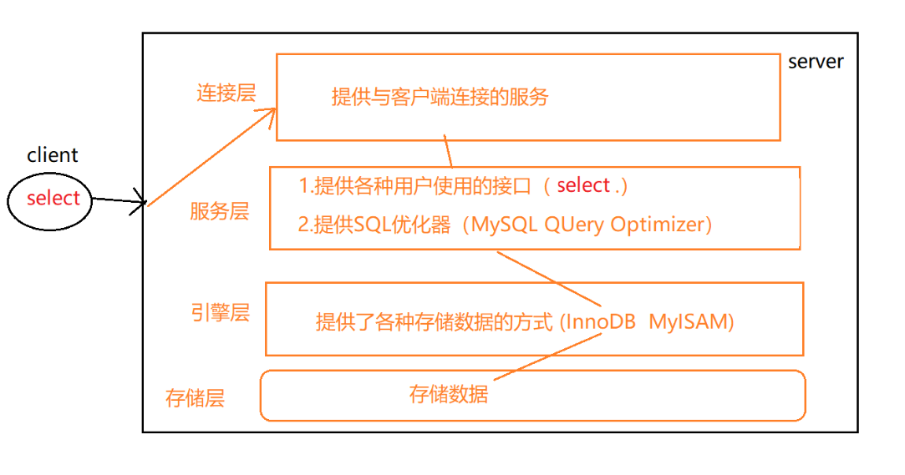
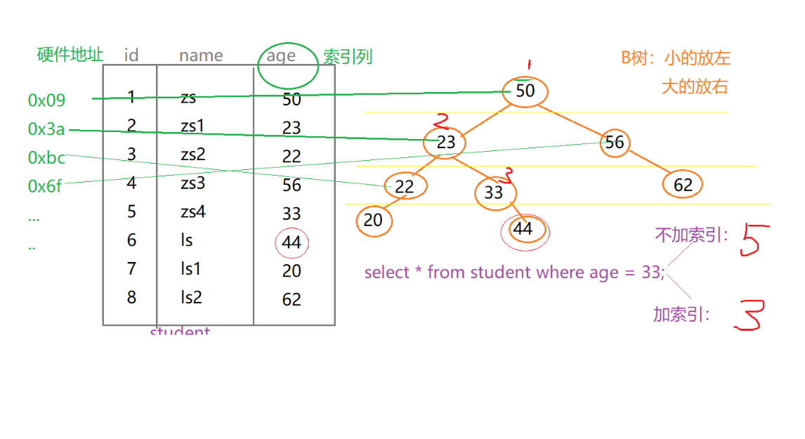
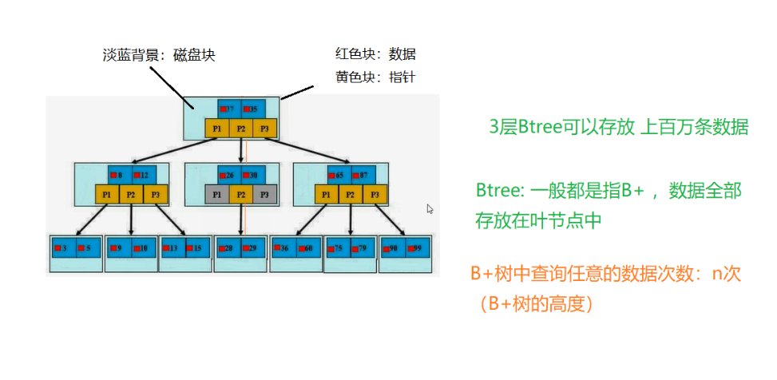

[TOC]

## MySQL优化(一)

### 1、原理

####  MYSQL逻辑分层 ：

连接层、服务层、引擎层、存储层



#### 查询数据库引擎：  

支持哪些引擎？ show engines ;
查看当前使用的引擎   show variables like '%storage_engine%' ;

```mysql
指定数据库对象的引擎：
create table tb(
	id int(4) auto_increment ,
	name varchar(5),
	dept varchar(5) ,
	primary key(id)		
)ENGINE=MyISAM AUTO_INCREMENT=1
 DEFAULT CHARSET=utf8   ;
```
### 2、SQL优化

原因：性能低、执行时间太长、等待时间太长、SQL语句欠佳（连接查询）、索引失效、服务器参数设置不合理（缓冲、线程数）

#### SQL ：

​	编写过程：
​		select dinstinct  ..from  ..join ..on ..where ..group by ...having ..order by ..limit ..

解析过程：			
	from .. on.. join ..where ..group by ....having ...select dinstinct ..order by limit ...

#### SQL优化， 主要就是 在优化索引

​	索引： 相当于书的目录 、可以提高查询效率
​	索引： index是帮助MYSQL高效获取数据的数据结构。索引是数据结构（树：B树(默认)、Hash树...）


#### B树的原理图：



如果使用索引需要3步找到所需数据，不使用索引则需要5步。



**索引的弊端**：
			1.索引本身很大， 可以存放在内存/硬盘（通常为 硬盘）
			2.索引不是所有情况均适用： a.少量数据  b.频繁更新的字段   c.很少使用的字段
			3.索引会降低增删改的效率（增删改  查）因为要更新索引**

**因为要更新索引，所以降低了增删改的效率**

**优势**：1提高查询效率（降低IO使用率）
		      2.降低CPU使用率 （...order by age desc,因为 B树索引 本身就是一个 好排序的结构，因此在排序时  可以直接使用）

### 3、索引

#### 分类

主键索引：  不能重复。id    不能是null
		唯一索引  ：不能重复。id    可以是null
		单值索引  ： 单列， age ;一个表可以多个单值索引,name。
		复合索引  ：多个列构成的索引 （相当于 二级目录 ：  z: zhao）  (name,age)   (a,b,c,d,...,n)
默认为主键索引，唯一索引的值可以取null

#### 创建索引:

​		方式一：
​		create 索引类型  索引名  on 表(字段)
​		单值：
​		create index   dept_index on  tb(dept);
​		唯一：
​		create unique index  name_index on tb(name) ;
​		复合索引
​		create index dept_name_index on tb(dept,name);

方式二：alter table 表名 索引类型  索引名（字段）

单值：
alter table tb add index dept_index(dept) ;
唯一：
alter table tb add unique index name_index(name);
复合索引
alter table tb add index dept_name_index(dept,name);

注意：如果一个字段是primary key，则该字段默认就是 主键索引	
	删除索引：
drop index 索引名 on 表名 ;
drop index name_index on tb ;

查询索引：
show index from 表名 ;
show index from 表名 \G

### 4、SQL性能

a.分析SQL的执行计划  : explain   ，可以模拟SQL优化器执行SQL语句，从而让开发人员 知道自己编写的SQL状况
	b.MySQL查询优化其会干扰我们的优化

优化方法，官网：https://dev.mysql.com/doc/refman/5.5/en/optimization.html

查询执行计划：  explain +SQL语句
		explain  select  * from tb ;

.assets/1564636004618.png)

 id : 编号				
 select_type ：查询类型
 table ：表
 type   ：类型
 possible_keys ：预测用到的索引 
 key  ：实际使用的索引
 key_len ：实际使用索引的长度     
 ref  :表之间的引用
 rows ：通过索引查询到的数据量 
 Extra     :额外的信息

#### (1)id

**id: id值相同，从上往下 顺序执行。**

**表的执行顺序  因数量的个数改变而改变的原因： 笛卡儿积**

.assets/1564636115041.png)

**数据小的表 优先查询；**

**id值不同：id值越大越优先查询 (本质：在嵌套子查询时，先查内层 再查外层)**

子查询+多表： 
explain select t.tname ,tc.tcdesc from teacher t,teacherCard tc where t.tcid= tc.tcid
and t.tid = (select c.tid from course c where cname = 'sql') ;

**id值有相同，又有不同： id值越大越优先；id值相同，从上往下 顺序执行**

#### (2)select_type:查询类型

PRIMARY:包含子查询SQL中的 主查询 （最外层）
SUBQUERY：包含子查询SQL中的 子查询 （非最外层）
simple:简单查询（不包含子查询、union）
derived:衍生查询(使用到了临时表)

​	a.在from子查询中只有一张表
​		explain select  cr.cname 	from ( select * from course where tid in (1,2) ) cr ;

b.在from子查询中， 如果有table1 union table2 ，则table1 就是derived,table2就是union
	explain select  cr.cname 	from ( select * from course where tid = 1  union select * from course where tid = 2 ) cr ;

.assets/1564636407703.png)

union:上例
union result :告知开发人员，那些表之间存在union查询


#### (3)type 类型

system > const > eq_ref > ref > fulltext > ref_or_null > index_merge > unique_subquery > index_subquery > range > index > ALL

其中system、const只是理想情况；实际能达到 ref>range 。要对type进行优化的前提： 有索引

**system（忽略）**: 只有一条数据的系统表 ；或 衍生表只有一条数据的主查询

**const**:仅仅能查到一条数据的SQL ,用于Primary key 或unique索引  （类型 与索引类型有关）

**eq_ref**:唯一性索引：对于每个索引键的查询，返回匹配唯一行数据（有且只有1个，不能多 、不能0）  比如id
select ... from ..where name = ... .常见于唯一索引 和主键索引。

**ref**：非唯一性索引，对于每个索引键的查询，返回匹配的所有行（0，多）

尽量达到 ref 级别

**range**：检索指定范围的行 ,where后面是一个范围查询(between   ,> < >=,     特殊:in有时候会失效 ，从而转为 无索引all)

**index**：查询全部索引中数据
explain select tid from teacher ; --tid 是索引， 只需要扫描索引表，不需要所有表中的所有数据

**all**：查询全部表中的数据
explain select cid from course ;  --cid不是索引，需要全表所有，即需要所有表中的所有数据

**system/const: 结果只有一条数据**
**eq_ref:结果多条；但是每条数据是唯一的 ；**
**ref：结果多条；但是每条数据是是0或多条 ；**


