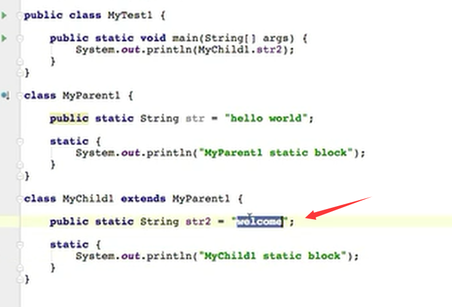
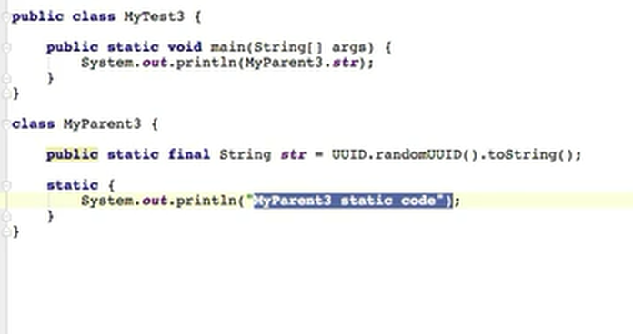

## 第一章

### 1、类加载

**在java代码中，类的加载、连接、与初始化过程都是在程序运行期间完成的**

**提供了更大的灵活性，增加了跟多的可能性。**

### 2、类加载器深入剖析

### 3、类的加载、连接与初始化

### 4、类的使用与卸载

使用

卸载

卸载的意思是从内存中剔除这个类。

### 5、java对类的使用方式

- 主动使用

  

  

  

- 被动使用

  除了上面提到的七种情况，其他使用java类的方法被看作对类的**被动使用**，是不会导致类的**初始化**。

**所有的java虚拟机实现必须在每个类或接口被java 程序 “首次主动使用” 时才初始化他们。**

### 6、类的加载

加载 .class 文件的方式

#### 例子1

执行结果是？

**对于静态字段来说，只有直接定义了该字段的类才会被初始化。**

**由于只是使用了父类的str  没有使用子类的，所以子类不会被初始化，也就不会 出现子类的 static代码块。**

（所有的java虚拟机实现必须在每个类或接口被java 程序 “首次主动使用” 时才初始化他们。）

#### 例子2

新增一行后

**使用了 str2， 是对子类的主动使用，所以结果里有子类的static 代码快。**

**当一个类在初始化时，要求其父类必须全部初始化完毕。**

（主动使用，初始化一个类的子类时）

#### 例子3

结果只有：  hello  world

分析：**常量在编译阶段会存入到调用这个常量的方法所在的类的常量池中，**

（即  这个常量会被存入  MyTest 类的常量池中）

**本质上，调用类并没有直接引用到定义常量的类，因此并不会触发定义常量的类的初始化。**

（所以对于调用 Myparent2.str      没有直接引用到Myparent2     没有触发类的初始化，所以static没有执行）

对上面的类进行反编译之后

助记符：

ldc 表示 将int float 或者 String 类型的常量值从常量池中推送至栈顶

bipush 表示将单字节（-128-127）的常量值推送至栈顶

sipush 表示将一个短整型常量值 （-32768-32787） 推送至栈顶

iconst_-1   iconst_5    表示将 int 类型1推送至栈顶。

#### 例子4

不管是final 还是不带final 都是常量，但这个就执行了static代码块。

但是上面的例子在编译期间是知道的，而这个例子中是不知道的，只有运行期间才是知道的。

**当一个常量的值并非编译期间可以确定的，那么其值就不会被放到调用类的常量池中，这时在程序运行时，会导致主动使用这个常量所在的类，所以会导致这个类被初始化。**

#### 例子5

**只会执行一次static代码块，因为只有第一次主动使用时，才会初始化类。**

#### 例子6

没有任何输出

因为不是对类的主动使用，所以不会初始化也就没有static执行。

而new 出来的类型可以使用，    getClass（） 方法查看。

对于此例，是生成了一个由java虚拟机在运行期间创建出来的。

**对于数组实例来说，其类型是由jvm在运行期间动态生成的，表示为 包名.jvm.classloader.类名  这种形式。动态生成的类型，其父类型就是Object 。对于数组来说，JavaDoc 经常将构成数组的元素为Component，实际上就是将数组降低一个维度后的类型。**

助记符

annewarray    表示创建一个引用类型（数组、接口、类）的数组，并将其引用值压入栈顶。

newarray  表示创建一个指定给的原始类型（int 、float、char）的数组，并将其引用值压入栈顶。

