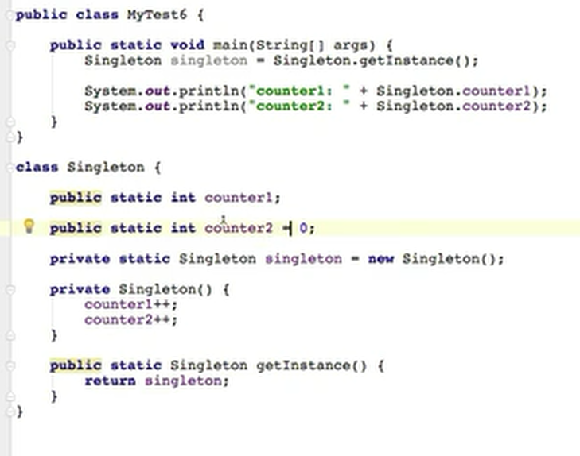
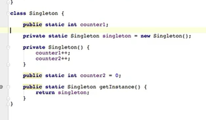
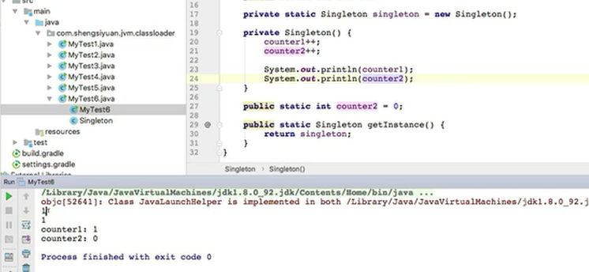
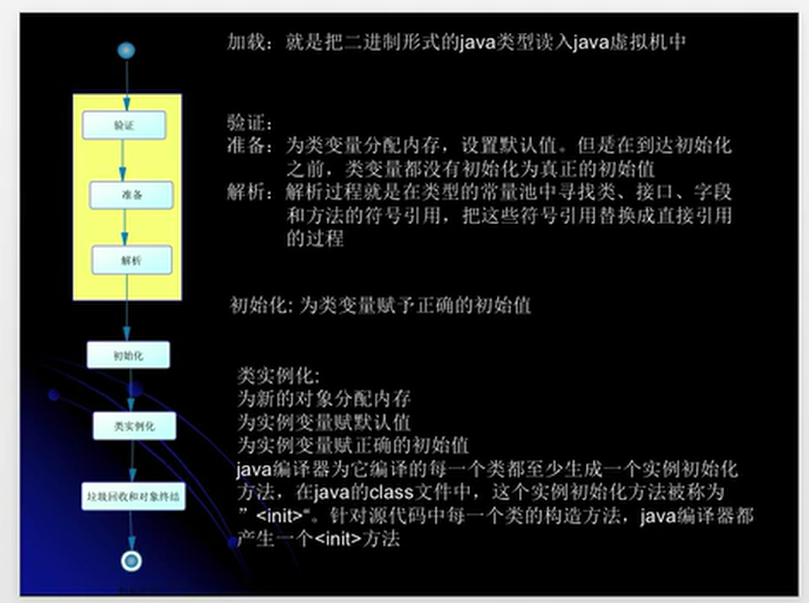
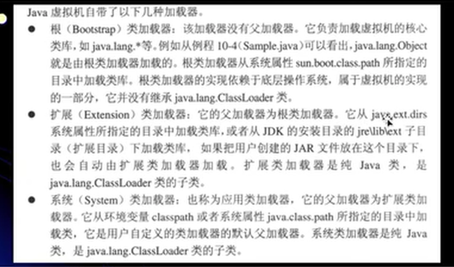
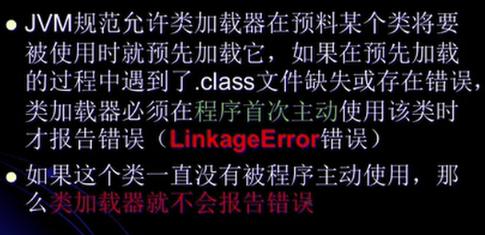
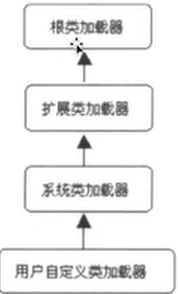
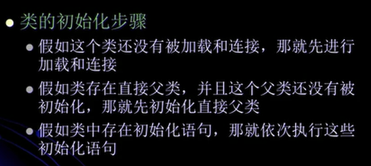

## 第二章

### 接口初始化规则与类加载器准备阶段和初始化阶段

当一个接口在初始化时，并不要求其父接口都完成了初始化。

只有当真正使用到父接口时（如引用接口中的所定义的常量时 ），才会初始化。

结果都是   1 

调用方法时，return singleton    而singleton 是new 出来的，所以会调用 Singleton（） 。

**改变部分语句位置之后**

结果是   1    0

 

可以进下如下测试

主函数中调用了静态方法，由于是对这个类的主动使用，所以在初始化的时候都对这两个数进行了赋值，都自增，所以是1，然后又对第二个变量进行赋值所以是  1  0.

### 类加载过程

#### 类的加载

1、类的加载的最终产品是位于内存中的Class对象

2、Class 对象分装了类在方法区的数据结构，并且向使用者提供了访问方法区内的数据结构的接口

3、有两种类型的类加载器

1. java虚拟机自带的加载器
   - 根类加载器（Bootstrap）
   - 扩展类加载器（Extension）
   - 系统（应用）类加载器 （System）
   - 
2. 用户自定义的类加载器
   - java.lang.ClasssLoader 的子类
   - 用户可以定制类的加载方式

4、类加载器并不需要等到某个类被 “首次主动使用” 时再加载他

当加载类时，会使用委托机制，当上一层的加载器不能加载时才使用下一层的加载器。

#### 类的验证

类被加载后，就进入连接阶段。连接就是将已经读入到内存的类的二进制数据合并到虚拟机的运行环境中去。

#### 类的初始化

#### 类的初始化时机

只有当程序访问的静态变量或静态方法确实在当前类或当前接口中定义时，才可以认为是对类或接口的主动使用。

